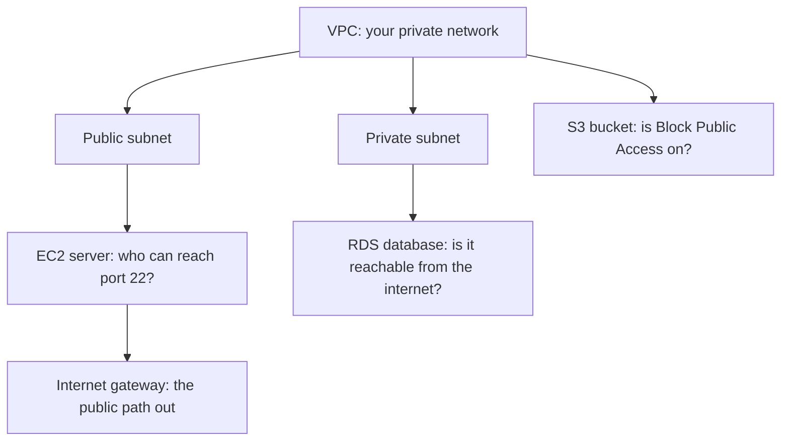
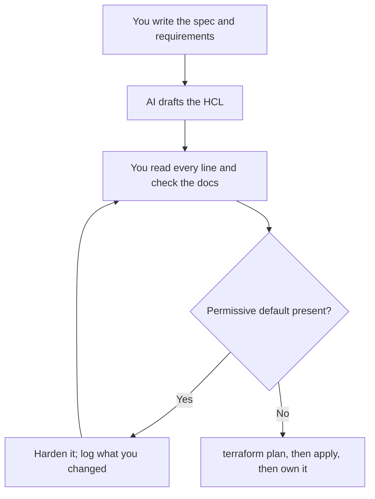

# Lab 11.1: AWS Free-Tier Build

**Month:** 11 (Cloud and AI System Security)
**Pattern family:** Cloud and AI attack surfaces
**Time budget:** 12 hours (across multiple sessions; do not attempt in one)
**Lab attempt floor:** 90 minutes
**AI guidance:** Infrastructure-as-Code drafting pattern. You design the architecture and write the security requirements yourself. Then you may use AI to draft individual Terraform resources you have already specified. You read and harden every line. AI Provenance log mandatory. See "AI guidance for this lab."
**Prerequisites:** Month 11 README read in full, including the cost and scope warnings and "AI augmentation this month." Month 3 (subnets, CIDR, routing). Month 5 (the drafting pattern, which this lab scales to infrastructure). An AWS account you control. An AI coding tool configured. `AI-ETHICS.md` and `SAFETY.md` re-read.

**Recall first, from memory, before you read on:** in Month 5 you used the drafting pattern on Python code. What were the five steps of that loop, and what decided whether a draft was good enough to keep? (Hold your answer. This lab runs the same loop, but on infrastructure code instead of Python.)

## The cost rule, first, because it bills a real card

This is the first lab in the course that spends money. Read this before you touch a console.

- AWS's free tier is narrow and time-limited. Some resources you will create (an RDS instance, an EC2 instance) are free only in specific sizes, only for a set number of hours per month, and only for the first 12 months of a new account. Others (a NAT gateway, an unattached **Elastic IP** (a reserved public address), data transfer out of AWS) bill from the first hour with no free allowance.
- A forgotten resource is the classic way to get a surprise bill. The most common cloud beginner story is a NAT gateway or an RDS instance left running over a weekend.
- You have three defenses. Set a budget alarm before you build (Task 1). Pick the smallest free-tier-eligible option at every choice. Tear everything down at the end of every session (Task 7). The teardown is graded.

If you are ever unsure whether something bills, assume it does. Check the AWS pricing page for that service. Do not leave it running while you investigate.

## The scope rule, also first, because it is not optional

You build and test in **your own AWS account only**. The resources you create are yours, so testing them is trivially authorized. You do not point any tool at another account, another customer, an IP that is not yours, or any AWS resource you did not create. `SAFETY.md` is in force. A scan or an API call against infrastructure you do not own is the same federal crime in the cloud as it is anywhere, and "it was in the same region" is not authorization.

## Why this lab exists

Cloud security is not separate from the networking, identity, and logging you already know. It is those same skills, reached through a control plane over an API. You cannot reason about a cloud breach until you have stood up cloud infrastructure with your own hands. Only then do you see where the security decisions live: which subnet is public, which security group rule is open, whether the bucket blocks public access, where the database sits.

You build it with Terraform, not by clicking in the console, because reviewable code is itself a security control. A console click leaves no diff to review. A Terraform plan shows exactly what will change before it changes. This lab also makes your Terraform the base for Lab 2 (where you break this environment on purpose), and it gives you the raw material for your `cloud-misconfigs.md` deliverable.

Here is what you are about to build, and the one security-relevant question for each piece:


*Notice: the private subnet has no path to the internet gateway on purpose. The database should not be reachable from outside; the diagram shows why that is a structural choice, not just a setting.*

## Learning objectives

By the end of this lab, you can:

- Explain the AWS shared responsibility model for each service you provision, stating which line items are AWS's and which are yours.
- Build a VPC with a public and a private subnet, an internet path, an EC2 instance, an S3 bucket, and an RDS instance, entirely in Terraform.
- Read a Terraform plan and predict its effect before applying, and explain every resource and argument in your configuration.
- Apply least privilege and Block Public Access from the start, rather than opening things and narrowing later.
- Set an AWS Budgets alarm and tear an environment down to zero billable resources, and prove it.
- Apply the IaC-drafting pattern: specify, draft with AI, verify against provider docs, harden, own.

## Recognition cue

When you need repeatable infrastructure you can review, diff, and tear down, you reach for Terraform rather than the console. When you stand up anything in a billed account, you reach for the budget alarm and the teardown plan first. This lab builds both reflexes.

## AI guidance for this lab

The IaC-drafting pattern is the Month 5 drafting pattern scaled to infrastructure. Follow it exactly.

**Allowed:** After you have written your architecture and your security requirements (Task 2) and named the resources you intend to create, you may ask AI to draft the HCL for a specific resource you have specified, for example "draft an `aws_vpc` and two `aws_subnet` resources, one public and one private, in CIDR 10.0.0.0/16." You then read every line, confirm each argument against the Terraform AWS provider documentation, and harden anything left soft.

**Not allowed:** Asking AI to design your architecture, choose your CIDR plan, or decide your security posture. Pasting generated HCL into a billed `apply` without reading it. Accepting a generated security group open to `0.0.0.0/0` or a bucket without Block Public Access because it "works." Letting any block into your configuration you cannot explain line by line.

**Why the discipline bites hardest here:** AI drafts permissive infrastructure by default, because permissive infrastructure provisions without errors. A draft security group will often allow all inbound traffic; a draft bucket will often omit the public-access block; a draft IAM policy will often grant more than you need. Every one of those is a finding you would write up against a client in Lab 5. Catching them in the draft, before `apply`, is the entire point of doing this with AI under discipline.

**Logged:** Every AI interaction goes in your AI Provenance section, especially the drafts you hardened or discarded. "Asked for the security group; the draft allowed 0.0.0.0/0 on 22; I narrowed it to my home /32 and added a comment explaining why" is a real provenance entry.

## Tasks

Do these in order. The budget alarm is first and the teardown is last for a reason.

### Task 1: Account hygiene and the budget alarm (60 minutes)

Before any infrastructure, secure the account and arm the cost tripwire. Turn on **multi-factor authentication** (a second login factor beyond the password) for the account. Create an IAM user (or use IAM Identity Center) for your Terraform work, rather than using the account root. The root user should not be your daily driver. Then create an AWS Budgets budget with an alarm that emails you when forecasted or actual spend crosses a small threshold you pick (a few dollars is right for this month).

**Checkpoint:** multi-factor authentication is on, a non-root identity exists and is the one you will use, and a budget alarm is configured with a confirmation you can show. The threshold and your reason for it are in your notebook.
**If not:** if the budget alarm gives no confirmation email, check that you entered an email and confirmed the subscription; some alarms need you to click a confirmation link before they are active. If you are still using root, stop and create the IAM user now; everything after this assumes a non-root identity.

### Task 2: Architecture and security requirements, before any AI (90 minutes)

With no AI, write down what you are going to build and the security posture it must have. At minimum:

- A VPC CIDR and a split into a public subnet (for the EC2 instance) and a private subnet (for the RDS database).
- The internet path for the public subnet, and the deliberate absence of one for the private subnet.
- Your security requirements as explicit statements: which ports are reachable and from where (SSH only from your own IP, not the world); the S3 bucket must block all public access; the database must not be publicly accessible; data at rest should be encrypted where the free tier allows.

This is the spec AI is allowed to draft against. The floor applies: sit with the design for the full 90 minutes before reaching for anything.

**Checkpoint:** a `SPEC.md` in your `cloud-lab/` working directory describes the architecture and lists the security requirements as testable statements. It was written before you involved AI.
**If not:** if your requirements read like "secure the bucket" rather than "all four Block Public Access settings are on," they are not testable yet. Rewrite each as something you could later check yes or no against the running infrastructure.

### Task 3: Learn the IaC-drafting pattern, then build the environment (gradual release)

The new skill this lab teaches is not "use Terraform." It is "use AI to draft infrastructure you can fully defend, and catch the soft spots before you apply." You learn that loop in three stages. The worked example uses a throwaway resource that is **not** part of your graded environment, so you can focus on the method.

The loop you are learning has the same shape as the diagram below. Notice it never trusts the draft.


*Notice: the hardening loop runs before `apply`, never after. Catching a permissive default in the plan is the whole point of drafting under discipline.*

#### Stage 1 - Worked example (I do)

Study this complete worked example of the loop on a throwaway, standalone S3 bucket. This bucket is a teaching case, not part of your graded build; you can destroy it right after. The point is to see the soft spot and harden it.

You spec it: "a private S3 bucket for logs, with all four Block Public Access settings on, and server-side encryption enabled." You ask AI to draft it. Suppose AI returns this:

```hcl
resource "aws_s3_bucket" "logs" {
  bucket = "my-throwaway-logs-bucket"
}
```

Read it against your spec. The bucket exists and "works," but notice what is missing: there is no `aws_s3_bucket_public_access_block`, and no encryption. AI drafted the minimum that provisions without an error, which is exactly the soft spot the README warned about. So you harden it by adding the guardrail block AI left out:

```hcl
resource "aws_s3_bucket_public_access_block" "logs" {
  bucket                  = aws_s3_bucket.logs.id
  block_public_acls       = true
  ignore_public_acls      = true
  block_public_policy     = true
  restrict_public_buckets = true
}
```

Now all four settings are on, and you can explain each one. That gap, AI omitting the public-access block, is the single most common AI Terraform draft error, and catching it is the skill.

**Checkpoint:** you can state, in one sentence each, what the four `block_/ignore_/restrict_` settings do, and why AI's first draft was a finding.
**If not:** re-read the Block Public Access concept in the month README and the provider docs for `aws_s3_bucket_public_access_block`. Do not move on until you can name what the original draft exposed.

#### Stage 2 - Faded practice (we do)

Now run the loop yourself on one network resource: the SSH security group. The skeleton below is the spec and the soft spot to watch for; you write the prompt to AI, read the draft, and harden the blank. The full block is yours to obtain and own.

```hcl
# Goal: a security group that allows SSH (port 22) from YOUR home IP only.
resource "aws_security_group" "ssh" {
  name   = "ssh-from-home"
  vpc_id = aws_vpc.main.id

  ingress {
    from_port   = 22
    to_port     = 22
    protocol    = "tcp"
    cidr_blocks = [ ___ ]   # TODO: your home IP as a /32, NEVER "0.0.0.0/0"
  }
  # egress block omitted for brevity
}
```

When you prompt AI for this, it will very often fill `cidr_blocks` with `["0.0.0.0/0"]`, because that draft provisions without error. That is the finding you are here to catch. Replace it with your own address as a `/32`.

**Checkpoint:** your security group's SSH ingress lists your own IP as a `/32`, not `0.0.0.0/0`, and you can explain in your notebook why each ingress rule is present.
**If not:** if AI's draft had `0.0.0.0/0` and you kept it, you just built the open-management-port finding from Lab 2 on purpose. Narrow it to your `/32`. To find your current public IP, search "what is my IP" or use a service you trust; confirm it before you apply.

#### Stage 3 - Independent (you do)

No scaffolding now. Build the full environment from your Task 2 spec, using the drafting loop where it helps and reading every plan in full before you apply.

- **The network:** the VPC, the public and private subnets, the internet gateway and routing for the public subnet only, and the security groups.
- **The compute and storage:** the EC2 instance in the public subnet, the S3 bucket, and the RDS instance in the private subnet. Choose free-tier-eligible sizes deliberately. The bucket must have all four Block Public Access settings on from the moment it is created; do not create it open and fix it later. The database must not be publicly accessible.

Run `terraform plan` and read it in full before every `terraform apply`. The plan must hold no surprises against your spec.

**Checkpoint:** `terraform plan` is clean and matches your spec; the VPC, subnets, routing, security groups, EC2, S3, and RDS all exist; the bucket's public-access block shows all four settings on; RDS is not publicly accessible; and you can SSH to the EC2 instance from your own IP and not from elsewhere. Sample `terraform apply` output is saved for your notebook.
**If not:** if `plan` shows a resource you did not intend, stop and read it; an unexpected change is the signal the drafting discipline exists to catch. If you cannot SSH in, check that your security group allows your current IP (it may have changed) and that the instance is in the public subnet with a route to the internet gateway.

### Task 5: Map the shared responsibility model (60 minutes)

For each of the four services you provisioned (VPC, EC2, S3, RDS), write a short table: what AWS is responsible for, and what you are responsible for. Be specific. For EC2, the guest operating system patches are yours; for RDS, the database engine patching is largely AWS's but the network exposure and credentials are yours; for S3, the durability is AWS's but the access policy is entirely yours.

**Checkpoint:** a `shared-responsibility.md` has a per-service breakdown, and at least one line per service is a responsibility that, if neglected, becomes one of the misconfigurations you will reproduce in Lab 2.
**If not:** if a table just repeats "AWS does the hardware, I do my data," push for specifics. For RDS, who patches the engine versus who sets network exposure? For S3, who guarantees durability versus who sets the access policy?

### Task 6: Read your own infrastructure (60 minutes)

Go back through your Terraform with the provider docs open. Confirm you can explain every resource and every non-default argument. For at least three resources, write a one-paragraph explanation: what the resource is, what its security-relevant arguments do, and what would change if you set them wrong. This is where you turn AI-drafted HCL into HCL you own.

**Checkpoint:** three paragraphs are in your notebook under "Infrastructure I can now defend." The tutor's verification ritual draws from these.
**If not:** if you cannot explain an argument, that is the block you do not own yet. Read its provider-docs page and write the explanation before counting the task done; an unexplained block will fail the verification ritual.

### Task 7: Tear it down and prove it (60 minutes)

Run `terraform destroy`. Then verify, independently of Terraform's own report, that nothing billable remains. Check the EC2, S3, RDS, and VPC consoles. Check that no unexpected resources survive (an orphaned Elastic IP, a leftover snapshot). Note what `terraform state list` shows (it should be empty) and what the billing or cost-explorer view shows trending toward zero.

**Checkpoint:** `terraform destroy` completed, `terraform state list` is empty, and you have independently confirmed no billable resources remain. This task is graded; an environment left running is an open finding against yourself.
**If not:** if `destroy` errors partway, read which resource blocked it (often a dependency still in use) and resolve that, then re-run. If the console still shows a resource Terraform thinks is gone, delete it by hand and note the drift; a resource outside Terraform's state is exactly how surprise bills happen.

### Task 8: Notebook entry with AI Provenance (60 minutes)

Write `.tutor/notebook/lab-01-aws-free-tier-build.md`. Required sections:

- **Pre-flight check** for Terraform and the AWS CLI: what `terraform plan`, `apply`, and `destroy` do (to your local state and to the AWS control plane), what artifacts they leave (state files locally, resources and CloudTrail entries in AWS), what could go wrong (a destructive apply, a leaked state file containing secrets, a forgotten resource that bills), and the authorization scope (your own account).
- **Concept naming.** It is not "I learned Terraform."
- **Evidence:** the clean plan, the apply output, the proof of teardown, the shared-responsibility table.
- **Five-question debrief.**
- **AI Provenance:** which AI tool, the prompts that produced each drafted resource, what was generated, how you verified each block against the provider docs, and what you hardened or discarded (especially any permissive default you caught).

**Checkpoint:** a committed entry has all sections, including a substantive AI Provenance section.
**If not:** if your provenance reads "used AI for the Terraform," it is too shallow and the entry is rejected. Record the prompt, what AI generated, the permissive default you caught, and how you hardened it. The test is whether a reader could redo your AI session from your notes.

## Definition of Done

You are done when all of these are true:

- The budget alarm is armed and a non-root identity is in use (Task 1).
- `SPEC.md` was written before any AI (Task 2).
- The full environment exists, `terraform plan` matched your spec, the bucket shows all four Block Public Access settings on, RDS is not publicly accessible, and SSH works from your IP only (Task 3).
- `shared-responsibility.md` and your three "Infrastructure I can now defend" paragraphs exist (Tasks 5 and 6).
- `terraform destroy` ran, `terraform state list` is empty, and you independently confirmed no billable resource remains (Task 7).
- The notebook entry is committed with a real AI Provenance section (Task 8).

The tutor will run the verification ritual: it picks one Terraform resource and asks you to explain it from memory, with your AI session closed. A likely target is your SSH security group ingress or your S3 public-access block, because those are where AI drafts are most often permissive and where your hardening matters most.

**Self-explain:** in one sentence, why does turning on all four Block Public Access settings protect the bucket even if a teammate later adds a public bucket policy?

## Failure modes to expect

- You will, at least once, leave something running. Build the teardown-then-verify habit now, while the stakes are a few dollars, not a production bill.
- AI will draft a security group open to the world and a bucket without Block Public Access. If you apply those without reading them, you have built the very misconfigurations Lab 2 asks you to reproduce, only by accident and on a billed account. Read every plan.
- A leaked Terraform state file can contain secrets (a database password in plaintext). Do not commit state to a public repository. Know where your state lives before you apply.
- The free tier has edges you will hit (an instance class that is not eligible, a region where a service costs more). The budget alarm is your backstop; the habit of checking the pricing page before you apply is the real fix.

## Time budget breakdown

- Task 1: 60 minutes
- Task 2: 90 minutes
- Task 3: 4 to 5 hours (Stage 1 ~30 min, Stage 2 ~60 min, Stage 3 the rest, across sessions)
- Task 5: 60 minutes
- Task 6: 60 minutes
- Task 7: 60 minutes
- Task 8: 60 minutes
- Buffer for things going wrong and for AWS being AWS: 60 to 120 minutes

Total: roughly 11 to 12 hours.

## Stretch goals

1. Add an S3 bucket policy that denies any request not using TLS (a `aws_iam_policy_document` with a condition on `aws:SecureTransport`), and explain what it protects against.
2. Move your Terraform state to a remote backend (an S3 bucket with versioning and a DynamoDB lock table) and explain why a remote, locked state is safer than a local one for team work.
3. Add Terraform `output` values for the EC2 public IP and the bucket name, and explain why outputs are safer than reading the console for the next lab.
4. Tag every resource with a `project = "month-11-lab"` tag, then use the cost-explorer view to confirm you can find this lab's spend by tag.

## Troubleshooting

- **`terraform apply` hangs creating RDS.** RDS instances take several minutes to create; that is normal. If it fails, read the error: a common cause is choosing an instance class that is not free-tier-eligible in your region.
- **You cannot SSH to the EC2 instance.** Three usual causes: your public IP changed (update the security group), the instance has no public IP or route to the internet gateway, or you are using the wrong key pair. Check each in order.
- **The plan wants to destroy and recreate something every apply.** Some argument is computed or out of sync. Read which resource and which attribute; do not just keep applying.
- **A leaked state file.** A Terraform state file can hold secrets in plaintext (a database password). Never commit state to a public repo. Know where your state lives before you apply.
- **Smart quotes break the HCL.** If you pasted from a document, curly quotes may have replaced straight quotes. Retype the line in your editor.

## Resources

- _docs_ The Terraform AWS provider documentation (primary source for every resource you write).
- _docs_ AWS VPC, EC2, S3, and RDS user guides (the shared-responsibility and free-tier-eligibility details).
- _docs_ AWS S3 "Blocking public access to your Amazon S3 storage" (the four Block Public Access settings).
- _docs_ AWS Budgets documentation (for the cost alarm in Task 1).
- _docs_ The AWS pricing page for each service you provision (check before you apply).
- Your own Month 3 notebook entries on CIDR and subnetting (for the VPC plan).
