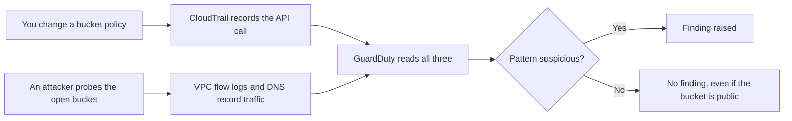

# Lab 11.2: Misconfigure and Detect

**Month:** 11 (Cloud and AI System Security)
**Pattern family:** Cloud and AI attack surfaces
**Time budget:** 10 hours (across multiple sessions)
**Lab attempt floor:** 90 minutes
**AI guidance:** Infrastructure-as-Code drafting pattern, for the remediation Terraform only. You specify and reason about the misconfiguration and the detection yourself. AI may draft only the corrective HCL you have specified. AI Provenance log mandatory. See "AI guidance for this lab."
**Prerequisites:** Lab 11.1 complete (you have a Terraform-defined environment and the teardown habit). Month 9 (logging, detection, the idea that you build detections rather than only consume alerts). The Month 11 cost and scope warnings.

**Recall first, from memory, before you read on:** in Month 9 you learned the difference between a log source and a detection. State it in one sentence. (You will use it directly: CloudTrail is the log source; GuardDuty is the detection; and this lab is about the gap between them.)

## The cost and scope rules, repeated because they still apply

Everything from Lab 1 holds. You work in your own account only. You set the budget alarm before you build (re-confirm it is still armed). You tear everything down at the end (Task 6, graded). This lab adds a service, GuardDuty, that is free only during a trial window and then bills per analyzed event. Enable it knowingly, and disable it in teardown. Reproduce misconfigurations only against resources you created. You are attacking your own bucket and your own instance to learn detection, not anyone else's anything.

## Why this lab exists

In Lab 1 you built infrastructure correctly. But most real breaches are not failures of the correct path. They are misconfigurations on a path someone took without thinking. This lab makes you create the two most common cloud misconfigurations on purpose, in a controlled account. Then you watch what the platform's logging and detection do and do not show. Then you fix the problem the right way. You will come out able to answer the three questions a cloud incident asks: what was exposed, who would have seen it happen, and what the durable fix is.

This is also the blue-team (defensive) half of the cloud weeks. Lab 3 is the offensive half, where the flaws games show you how these misconfigurations get exploited. Together they feed `cloud-misconfigs.md`. This lab gives you the detection and the Terraform fix for two of your five misconfigurations, with first-hand evidence.

These two tools see different things. Hold this picture before you start:


*Notice: a public bucket is a fact in CloudTrail, but not always a GuardDuty finding. GuardDuty raises an alarm on suspicious behavior, not on the mere existence of a risky setting. That gap is Task 4.*

## Learning objectives

By the end of this lab, you can:

- Reproduce a public-S3-bucket misconfiguration and an over-permissive security group in a controlled account, and explain precisely what each exposes.
- Read CloudTrail to reconstruct the API calls that created and exploited a misconfiguration, and explain what CloudTrail records and what it does not.
- Interpret a GuardDuty finding, including its type, severity, and the evidence behind it, and reconcile it against what you did.
- Distinguish what CloudTrail sees (control-plane API calls) from what GuardDuty infers (suspicious patterns across CloudTrail, VPC flow logs, and DNS) and what neither catches.
- Remediate each misconfiguration with Terraform, and verify the fix closed the exposure.
- Defend the detection and the fix from memory.

## Recognition cue

When you find a resource exposed, you ask the log first: who created this state, when, and from where. When you are handed a GuardDuty finding, you ask what evidence produced it and whether it is a true positive before you act. When you fix a misconfiguration, you fix it in code so it cannot drift back. This lab builds those instincts.

## AI guidance for this lab

The drafting pattern applies to the **remediation only**. You reason about the misconfiguration, the exposure, and the detection yourself; that reasoning is the learning and AI does not do it for you.

**Allowed:** Once you have specified the corrective control (for example, "the bucket must have all four Block Public Access settings on and a policy that grants no public principal"), you may ask AI to draft the Terraform for that control, then verify it against the provider docs and confirm it actually closes the exposure.

**Not allowed:** Asking AI to identify the misconfiguration for you, interpret your GuardDuty finding for you, or decide whether a finding is a true positive. Pasting a remediation you have not verified actually closes the hole. The detection reasoning is yours; only the corrective HCL may be drafted.

**Logged:** Provenance records the remediation drafts and your verification that each fix worked. It also records, this month, the misconfiguration steps you took, so your `cloud-misconfigs.md` rests on a reproducible record.

## Tasks

### Task 1: Enable logging and detection (60 minutes)

Confirm CloudTrail is recording management events in your account (a trail, or at least the event history). Enable GuardDuty, knowing it bills after its trial window. Give GuardDuty a short while to begin analyzing. Before you misconfigure anything, write down what you expect each tool to catch.

**Checkpoint:** CloudTrail is recording and you can query recent events. GuardDuty is enabled. A short prediction is in your notebook: for each misconfiguration you are about to make, which tool you expect to surface it, and why.
**If not:** if you cannot find any CloudTrail events, check that a trail exists or that you are reading the Event history view in the right region. GuardDuty needs a little time after you enable it before it produces anything; that delay is normal.

### Task 2: Reproduce the public bucket, safely (90 minutes)

On a bucket you created (use a fresh bucket with no real data, synthetic placeholder objects only), reproduce the classic public-read misconfiguration. Do this deliberately and document each step: what setting or policy you changed, and what that change means. Confirm the exposure from an unauthenticated position (for example, fetching an object's URL with no credentials).

**Do not put any real or sensitive data in this bucket.** Synthetic, throwaway content only. The exposure is the lesson; the data must be worthless.

**Checkpoint:** a bucket you own is briefly, deliberately, publicly readable, with only synthetic content in it. You have documented exactly which change (a disabled public-access block, a public bucket policy, a public ACL) produced the exposure, and confirmed it from an unauthenticated fetch. You have written down why this is the most reported cloud misconfiguration.
**If not:** if the object still will not fetch without credentials, the public-access block may still be on (it overrides a public policy by design); you must lower it for this controlled exercise. Re-read which of the four settings blocks a public policy versus a public ACL.

### Task 3: Reproduce the open security group (60 minutes)

On the security group attached to your EC2 instance, widen an ingress rule to the world (for example, a management port open to `0.0.0.0/0`). Document what this exposes, and how its risk differs from the bucket exposure (a network-reachable service versus readable data). Do not run any actual attack against the instance beyond confirming the port is now reachable from outside your prior allow list.

**Checkpoint:** the security group briefly admits a port from the world. You have documented what an attacker could now attempt and why this is a top-reported misconfiguration. You confirmed reachability without launching an exploit.
**If not:** if the port still seems unreachable from outside, check that you edited the security group actually attached to the instance, and that no network ACL on the subnet is also blocking it. Confirm reachability with a simple connection test, not an exploit.

### Task 4: Read the logs and reconcile (gradual release)

The new skill this lab teaches is reading a CloudTrail event and reconciling what each tool saw. You will learn it in three stages. The worked example uses a sample event record, not one from your own account, so you can focus on how to read the fields.

#### Stage 1 - Worked example (I do)

Study this trimmed, sample CloudTrail event record. It is a made-up example for teaching, not from your run. Read it field by field.

```json
{
  "eventName": "AuthorizeSecurityGroupIngress",
  "eventTime": "2026-05-20T14:03:11Z",
  "userIdentity": { "type": "IAMUser", "userName": "deploy-bot" },
  "sourceIPAddress": "203.0.113.45",
  "requestParameters": {
    "groupId": "sg-0abc123",
    "ipPermissions": { "items": [ { "fromPort": 22, "ipRanges": "0.0.0.0/0" } ] }
  }
}
```

Read it like an investigator. `eventName` says what was done: an ingress rule was added. `eventTime` is when. `userIdentity.userName` is who: the `deploy-bot` user. `sourceIPAddress` is from where. And `requestParameters` is the smoking gun: port 22 was opened to `0.0.0.0/0`. From these five fields you can reconstruct exactly who opened SSH to the world, when, and from what address. That is what CloudTrail gives you: the control-plane fact.

**Checkpoint:** you can point to the field in that record that tells you who made the change, and the field that tells you the change was dangerous.
**If not:** re-read the fields. "Who" is `userIdentity.userName`; "dangerous" is the `0.0.0.0/0` in `requestParameters`. The AWS CloudTrail docs describe the full event record structure if you want the complete field list.

#### Stage 2 - Faded practice (we do)

Now build the reconciliation table for your own two misconfigurations. The skeleton below has the columns; you fill the rows from your own CloudTrail and GuardDuty. The hard column is the last one, and it is the point of the whole lab.

```
| Misconfiguration | CloudTrail event (name, who, when) | GuardDuty finding? | What NEITHER would catch |
| ---------------- | ---------------------------------- | ------------------ | ------------------------ |
| Public bucket    | TODO: which Put* call, principal   | TODO: finding or none, and why | TODO |
| Open SSH group   | TODO: AuthorizeSecurityGroupIngress... | TODO | TODO |
```

For the public bucket, the CloudTrail call is one of `PutBucketPublicAccessBlock`, `PutBucketPolicy`, or `PutBucketAcl`, depending on how you made it public. GuardDuty may show nothing for the mere setting; that is expected, and the "why" goes in your notes.

**Checkpoint:** both rows are filled from your own logs, including an honest "GuardDuty finding or none, and why" for each.
**If not:** if you cannot find the bucket's `Put*` call, widen your CloudTrail time window and filter by the event name; the call happened when you made the change in Task 2.

#### Stage 3 - Independent (you do)

No scaffolding now. Complete the full reconciliation yourself:

- Reconstruct the timeline from CloudTrail for both misconfigurations, with the principal, time, and source IP for each.
- Interpret any GuardDuty finding fully (type, severity, the evidence behind it), or document clearly why the activity you generated did not trip one.
- Write the reconciliation: for each misconfiguration, what CloudTrail showed, what GuardDuty showed (or why it showed nothing), and what an attacker could have done that neither would have caught.

**Checkpoint:** a CloudTrail timeline for both misconfigurations with principal, time, and source; at least one GuardDuty finding interpreted with its evidence (or a clear reason none fired); and a written reconciliation of the gap between control-plane logging, behavioral detection, and what neither sees.
**If not:** if you expected GuardDuty to flag the public bucket and it did not, that is the lesson, not a bug. GuardDuty detects suspicious behavior, not the existence of a permissive setting. Write down that gap; it is exactly what Task 4 is for.

### Task 5: Remediate in Terraform and verify (90 minutes)

Fix both misconfigurations the right way: in your Terraform, not by clicking. For the bucket, restore all four Block Public Access settings and a policy with no public principal. For the security group, narrow the ingress back to your own IP. Apply, then verify the exposure is actually closed (the unauthenticated fetch now fails; the port is no longer reachable from outside your allow list). Here the drafting pattern applies: you may have AI draft the corrective blocks you specified, then you verify.

**Checkpoint:** both misconfigurations are corrected in Terraform, applied, and verified closed by the same external check you used to confirm the exposure. The fixes live in code so they cannot silently drift back.
**If not:** if the unauthenticated fetch still works after you apply the fix, the public policy or ACL may still be attached; the Block Public Access block restricts future grants but you may also need to remove the public grant itself. Re-run your external check until it fails the way you intend.

### Task 6: Tear down and prove it (60 minutes)

`terraform destroy` the environment. Disable GuardDuty so it stops billing. Verify nothing billable remains, the same independent way you did in Lab 1. Note that `terraform state list` is empty and the cost trend is toward zero in your notebook.

**Checkpoint:** environment destroyed, GuardDuty disabled, no billable resources remain, confirmed independently of Terraform's own report. Graded.
**If not:** if you forget GuardDuty, it keeps billing per event after its trial; disabling it is part of teardown. If `destroy` leaves a bucket behind because it is not empty, empty it first, then destroy.

### Task 7: Notebook entry with AI Provenance (60 minutes)

Write `.tutor/notebook/lab-02-misconfig-and-detect.md`. Required sections:

- **Pre-flight check** for CloudTrail and GuardDuty: what each does (CloudTrail records control-plane API calls; GuardDuty analyzes CloudTrail, VPC flow logs, and DNS for suspicious patterns), what artifacts they produce, what could go wrong (GuardDuty billing; misreading a finding and acting on a false positive), and the authorization scope (your own account, synthetic data).
- **Concept naming.**
- **Evidence:** the CloudTrail timeline, the GuardDuty finding(s), the before-and-after exposure checks, the remediation HCL.
- **Five-question debrief.**
- **AI Provenance:** which AI tool, the prompts behind any drafted remediation, how you verified each fix actually closed the exposure, what you discarded. The misconfiguration steps you took are recorded here too, for reproducibility.

**Checkpoint:** a committed entry has all sections, including a substantive AI Provenance section.
**If not:** missing or shallow provenance means rejection. The detection reasoning must be visibly yours, not AI's; only the remediation HCL may be drafted, and the entry must show how you verified it.

## Definition of Done

You are done when all of these are true:

- CloudTrail is recording and GuardDuty was enabled with a written prediction (Task 1).
- Both misconfigurations were reproduced with synthetic data only and confirmed from an unauthenticated position (Tasks 2 and 3).
- A CloudTrail timeline and a full reconciliation table exist, including an honest account of what GuardDuty did or did not catch and what neither would catch (Task 4).
- Both fixes live in Terraform, are applied, and are verified closed by the same external check (Task 5).
- The environment is destroyed, GuardDuty is disabled, and no billable resource remains (Task 6).
- The notebook entry is committed with a real AI Provenance section (Task 7).

The tutor will run the verification ritual on either your CloudTrail reconciliation (explain what an event field means, and what an attacker action would or would not appear in the log) or your remediation Terraform (explain why the fix closes the exposure). Detection reasoning you outsourced to AI will not survive this. That is by design.

**Self-explain:** in one sentence, why can a public bucket be a clear CloudTrail fact and yet produce no GuardDuty finding?

## Failure modes to expect

- You will leave the bucket or the security group exposed longer than the exercise needs, or forget to disable GuardDuty in teardown. Close exposures the moment you have confirmed them; teardown is graded.
- You will expect GuardDuty to flag every misconfiguration and be surprised when it does not. GuardDuty detects suspicious behavior, not the mere existence of a permissive setting; the existence of a public bucket is a CloudTrail and configuration fact, not necessarily a GuardDuty finding. The gap between the two is exactly what Task 4 asks you to articulate.
- You will be tempted to put a "realistic" file in the public bucket. Do not. Synthetic content only; a public bucket with real data is the breach you are studying, not a demo.
- You will fix the misconfiguration in the console because it is faster, then your Terraform will show drift. Fix it in code; that is the control.

## Time budget breakdown

- Task 1: 60 minutes
- Task 2: 90 minutes
- Task 3: 60 minutes
- Task 4: 2.5 hours (Stage 1 ~20 min, Stage 2 ~40 min, Stage 3 the rest)
- Task 5: 90 minutes
- Task 6: 60 minutes
- Task 7: 60 minutes
- Buffer: 60 minutes

Total: roughly 9 to 10 hours.

## Stretch goals

1. Write a simple detection of your own: query CloudTrail for any `AuthorizeSecurityGroupIngress` event whose parameters contain `0.0.0.0/0`, and explain why a control-plane query like this catches the risky setting that GuardDuty does not.
2. Enable S3 server access logging or CloudTrail S3 data events on your test bucket, then re-run the unauthenticated fetch and find your own request in the log. Explain the difference between management events and data events.
3. Turn one of your two reconciliations into a one-paragraph finding in the Month 10 report style, as a warm-up for `cloud-misconfigs.md`.

## Troubleshooting

- **GuardDuty shows no findings at all.** It needs time after enabling, and it raises findings on suspicious behavior, not on settings. A public bucket with no one probing it may produce nothing. That is the lesson, not a failure.
- **You cannot find the CloudTrail event.** Widen the time window, confirm you are in the right region, and filter by the exact event name (`PutBucketPolicy`, `AuthorizeSecurityGroupIngress`, and so on).
- **The fix does not close the exposure.** Block Public Access restricts future grants, but an existing public policy or ACL may still need removing. Re-run your external check until it fails the way you intend.
- **Terraform shows drift on the security group.** You probably fixed it in the console for speed. Undo that and fix it in code; the code is the control.

## Resources

- _docs_ AWS CloudTrail user guide (what is and is not logged; the event record structure).
- _docs_ AWS GuardDuty user guide (finding types, severities, the data sources it analyzes, and its pricing).
- _docs_ AWS S3 "Blocking public access" and "Bucket policy" documentation (for both the misconfiguration and the fix).
- _docs_ AWS VPC security group documentation (stateful, instance-level rules).
- _docs_ The Terraform AWS provider documentation (for the remediation resources).
- _reference_ The CIS Amazon Web Services Foundations Benchmark (the source from which the "common misconfigurations" of your deliverable are drawn; read the relevant S3, IAM, networking, and logging controls).
- Your own Month 9 notebook entries on detection and the difference between a log source and a detection.
