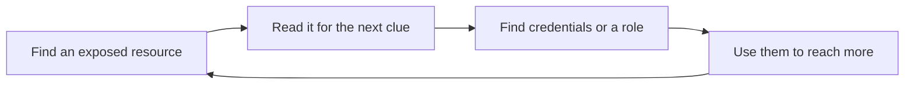

# Lab 11.3: flaws.cloud and flaws2.cloud

**Month:** 11 (Cloud and AI System Security)
**Pattern family:** Cloud and AI attack surfaces
**Time budget:** 10 hours (across multiple sessions)
**Lab attempt floor:** 45 minutes per stuck level
**AI guidance:** Restricted to synthesis after the floor, not solving. This is a CTF-style lab. During the floor: no AI, no walkthroughs, no level guides. After the floor, AI may help you synthesize what you found, never find it for you. No walkthrough of any level. AI Provenance log still mandatory. See "AI guidance for this lab."
**Prerequisites:** Labs 11.1 and 11.2 complete (you understand IAM, S3, security groups, and how misconfigurations are created and detected). The AWS CLI installed and configured. The Month 11 scope rule.

**Recall first, from memory, before you read on:** in Month 10 you worked CTF boxes under the floor. What is the floor, and what is the one rule about flags that the tutor never breaks? (You will need both here; these AWS games follow the exact same discipline.)

## The scope rule, and why these two targets are legal

`flaws.cloud` and `flaws2.cloud` are free AWS security training games you play in a browser and from the CLI. A cloud-security practitioner built them so people can learn to find and exploit AWS misconfigurations safely. They are intentionally vulnerable, and their terms of use authorize you to attack them. That authorization is what makes them legal targets, exactly as VulnHub VMs and HackTheBox boxes were in Month 10.

That authorization covers these two sites and nothing else. While working these games you will learn techniques (enumerating a bucket, assuming a role, reading instance metadata) that are crimes against any AWS account you are not authorized to test. Do not point a single command at any AWS resource that is not one of these two games or your own account. `SAFETY.md` governs this lab. The skill is the technique plus the discipline of only ever aiming it at an authorized target.

See `../ctf-set/README.md` for the platform listing and the scope basis.

## Why this lab exists

Labs 1 and 2 taught you to build and detect from the defender's chair. This lab puts you in the attacker's chair, against misconfigurations someone else built. That is what makes the controls you wrote in Lab 2 stop being abstract. Once you have personally walked from one public bucket to credentials to a deeper foothold, the line "enable Block Public Access and apply least privilege" carries the weight of something you have seen pay off from the other side.

`flaws.cloud` walks through a progression of S3 and IAM mistakes. `flaws2.cloud` adds an attacker track and a defender track, and goes deeper into roles, metadata, and privilege movement. Together they are the standard free hands-on introduction to cloud exploitation. They feed your `cloud-misconfigs.md` with attacker-side context for the controls you document.

Cloud attacks tend to follow one shape, no matter the specific flaw. Hold this pattern, then watch for it in the games:


*Notice: the loop is the same every time. Each misconfiguration hands the attacker the key to the next one. Your defender's job is to break any single link in this chain.*

## Learning objectives

By the end of this lab, you can:

- Enumerate an S3 bucket's contents and permissions from an unauthenticated and a low-privileged position, and explain at each step what permission made the next step possible.
- Explain how leaked or over-broad credentials let an attacker move from read access to role assumption to a deeper foothold.
- Explain what the EC2 instance metadata service exposes and why it is a credential-theft target (and what IMDSv2 changes).
- Map each level's underlying flaw to the AWS control that would have prevented it, in your own words.
- Maintain CTF discipline: the floor, the hint ladder, and the rule that the tutor never confirms a flag or a found URL.

## Recognition cue

When you see a misconfiguration in these games, you immediately ask: what control in Lab 2 would have stopped this, and is that control in my own Terraform? When you are tempted to read a walkthrough, you recognize that the walkthrough trades the only thing the lab is for (your own problem-solving under the floor) for speed you do not need. This lab builds the reflex of mapping attacker steps back to defender controls.

## AI guidance for this lab

This lab is not the IaC-drafting pattern. It is CTF-style, and the AI posture is the restrictive one you used in Month 10: synthesis only, and only after the floor.

**Allowed (after the floor on a given level):** Using AI to help you synthesize and articulate what you have already found yourself, for example "I found that this bucket was world-listable and contained a file pointing to the next subdomain; explain in general terms why an S3 bucket would be world-listable and what control prevents it." That is concept synthesis on a discovery you made.

**Not allowed:** Asking AI how to solve a level, what the next step is, where to look, or to walk you through any level. Pasting a level's contents, a found URL, or anything that amounts to "do this challenge for me." Using AI to shortcut the floor. These games are widely written up online; treat AI's knowledge of them the way you treat a published walkthrough, which is to say off-limits while you are solving.

**Logged:** Your AI Provenance section records any synthesis use, honestly, including the temptation to ask for more than synthesis and how you held the line.

## The CTF rules for this lab

- **The floor is 45 minutes per stuck level.** When you are stuck on a level, you sit with it, enumerate, read the AWS CLI and S3 documentation, and reason for 45 minutes before asking the tutor for a hint. The tutor will hold the floor and will not negotiate it down.
- **Hints come in the six-rung ladder, one rung per request.** The tutor guides; it does not solve. Past Rung 6 you either finish the level yourself or log a partial entry and move on, and the level returns as a cold revisit.
- **The tutor never confirms a flag or a found value.** These games sometimes signal progress with a value or a next subdomain. Do not paste it to the tutor and ask "is this right." The tutor does not confirm it; the game itself tells you whether you have progressed. This is the same rule as picoCTF and HackTheBox, and it is absolute.

## Tasks

### Task 1: Pre-flight the tools (45 minutes)

Before you attack anything, write the pre-flight for the tools you will use: the AWS CLI (specifically unauthenticated and low-privilege S3 commands, role assumption, and how the metadata service is queried). For each, write what it does at the API level, what it leaves in logs, what could go wrong if aimed at the wrong target, and the authorization scope (these two games and your own account only).

**Checkpoint:** a pre-flight entry covers the AWS CLI S3 and STS operations and the instance metadata service, with the scope explicitly stated. Written before you touch the games.
**If not:** if you are unsure what `aws s3 ls` does without credentials, that is exactly what Task 2 models on a safe target before you face a real one. Write what you can now, and complete this after Task 2.

### Task 2: Learn the enumeration method on a safe target (gradual release)

The new skill this lab teaches is enumerating an AWS resource you do not control and reading what each step reveals. You learn the method here, on a target you own or conceptually, so that when you face the games you bring a technique, not a blank stare. **This task never touches flaws.cloud.** The games are the independent test in Stage 3.

#### Stage 1 - Worked example (I do)

Study how unauthenticated S3 enumeration works, on a throwaway bucket you create in your own account. Make a bucket, drop a harmless text file in it, and (only in your own account, only for this exercise) make it world-listable. Now query it the way an attacker would, with no credentials:

```zsh
# --no-sign-request means "do not use my credentials"; this is the anonymous view.
aws s3 ls s3://your-own-throwaway-bucket --no-sign-request
```

If the bucket is world-listable, this prints the object names, even though you sent no credentials. That is the whole lesson of the first cloud attack step: a misconfigured bucket answers strangers. Read the output, then immediately make the bucket private again and delete it. You have now seen, on your own resource, what "world-listable" actually means from the outside.

**Checkpoint:** you ran the anonymous list against your own bucket, saw it succeed while world-listable, and understand that no credentials were used.
**If not:** if it errors with access denied, the bucket is not actually public yet (the public-access block may still be on); for this one controlled exercise, lower it. If `--no-sign-request` is unfamiliar, read the AWS CLI S3 reference for it before moving on.

#### Stage 2 - Faded practice (we do)

Now extend the method yourself, still on your own resources. Two skills attackers chain after enumeration are role assumption and reading instance metadata. Practice the shape of each on your own account, filling the blanks:

```zsh
# Skill A: who am I right now? (attackers run this constantly to track their privilege)
aws sts get-caller-identity

# Skill B: assume a role you control, then check who you became
aws sts assume-role --role-arn ___ --role-session-name practice   # TODO: a role ARN in your own account
# (then configure the returned temporary keys and re-run get-caller-identity)
```

The point is not the specific commands; it is the habit of asking "who am I, and what can I reach from here" at every step. You will do exactly this inside the games, against their targets, under the floor.

**Checkpoint:** you can run `aws sts get-caller-identity`, explain what it tells an attacker, and describe in your own words what assuming a role changes about your identity.
**If not:** if `assume-role` fails, your current identity may lack permission to assume that role; that is itself a least-privilege lesson. Read the STS and IAM role docs and try a role you are allowed to assume.

#### Stage 3 - Independent (you do): work both games under full CTF discipline

No scaffolding now, and no walkthrough of any level, from this file, from AI, or from the web. Bring the method from Stages 1 and 2 to the games.

- **Work `flaws.cloud` end to end,** first level to last. For each level, log what you found, what misconfiguration made it possible, and (most important) which AWS control would have prevented it. Honor the floor on any level that stalls you.
- **Work `flaws2.cloud`,** the attacker track in full and at least the start of the defender track (which asks how you would have stopped each attack). Keep the same per-level log. The defender track connects most directly to your `cloud-misconfigs.md`; take notes accordingly.

Record the flaw and the lesson, never a step-by-step solution or a found value that would spoil the game for someone else.

**Checkpoint:** a per-level log for both games, in your own words, capturing each level's underlying misconfiguration and its preventive control; floor and hint-ladder discipline observed; no found value ever pasted to the tutor.
**If not:** if you are stuck past the floor and Rung 6, log a partial entry and move on; the level returns as a cold revisit. If you feel the pull to read a walkthrough, that is the exact moment the floor is protecting your learning; sit with the enumeration instead.

### Task 3: Map flaws to controls (60 minutes)

Across both games, build one table: each distinct misconfiguration you encountered, the AWS control that prevents it, and whether that control is present in your own Lab 1 and Lab 2 Terraform. This table is a direct input to `cloud-misconfigs.md` and the strongest evidence that you understood the games rather than speed-ran them.

**Checkpoint:** a `flaws-to-controls.md` table maps at least five distinct misconfigurations to preventive controls and checks each against your own infrastructure.
**If not:** if you have fewer than five distinct misconfigurations, you may be listing levels rather than flaw types; group by the underlying mistake (public bucket, over-broad role, exposed metadata) and the count will clarify.

### Task 4: Notebook entry with AI Provenance (60 minutes)

Write `.tutor/notebook/lab-03-flaws-cloud.md`. Required sections:

- **Pre-flight check** (carry forward Task 1, expanded with anything you learned).
- **Concept naming.**
- **Evidence:** your per-level logs (flaws and lessons, not walkthroughs), the flaws-to-controls table.
- **Five-question debrief.** The fifth question (what you would do differently on a cold revisit) matters here; these levels return.
- **AI Provenance:** which AI tool, what synthesis you asked for after the floor, what that synthesis produced, how you checked it against your own findings, what you discarded, and an honest note on where you were tempted to ask for more than synthesis and did not.

**Checkpoint:** a committed entry has all sections, and the AI Provenance section reflects synthesis-only use.
**If not:** if the provenance shows AI was used to solve a level, the entry is rejected and those levels return as a cold revisit. Synthesis is "explain why a world-listable bucket is a risk after I found one"; solving is "tell me the next step."

## Definition of Done

You are done when all of these are true:

- A pre-flight entry covers the AWS CLI S3 and STS operations and the metadata service, with scope stated (Task 1).
- You practiced the enumeration method on your own resources and can explain each step (Task 2, Stages 1 and 2).
- Both games are worked through: `flaws.cloud` end to end, `flaws2.cloud` attacker track in full and the defender track at least begun, with a per-level log of flaw and preventive control (Task 2, Stage 3).
- `flaws-to-controls.md` maps at least five distinct misconfigurations to controls and checks each against your own infrastructure (Task 3).
- The notebook entry is committed with synthesis-only provenance (Task 4).

The tutor will run the verification ritual by naming one misconfiguration class from the games and asking you to explain, from memory, what made the attack possible and which AWS control prevents it. It will not ask you to reproduce a flag or a found value, and it will not confirm one if you offer it.

**Self-explain:** in one sentence, why does each level of these games tend to hand the attacker the key to the next one, and where would a single good control break that chain?

## Failure modes to expect

- The pull toward a walkthrough is strong because these games are so widely documented. Every walkthrough you read is learning you traded away. The floor exists precisely because the temptation is strongest where the answer is easiest to look up.
- You will treat a found value as a flag and want the tutor to confirm it. The tutor will not; the game tells you. Internalize this; it is the same discipline as every CTF in the course.
- You will rush to the next level without writing down the control that would have prevented the current one. That control is the entire deliverable value of this lab. Slow down and write it.
- You will be tempted to try a technique you just learned against a real AWS resource "to see if it works." That is a federal crime. The only authorized targets are these two games and your own account.

## Time budget breakdown

- Task 1: 45 minutes
- Task 2: Stage 1 ~30 min, Stage 2 ~30 min, Stage 3 ~6 to 7 hours (the two games, across sessions)
- Task 3: 60 minutes
- Task 4: 60 minutes
- Buffer for stuck levels (within the floor): 60 to 90 minutes

Total: roughly 9 to 10 hours.

## Stretch goals

1. After you finish, pick one level's misconfiguration and write the Terraform control that would have prevented it, then check whether your Lab 1 environment already has that control.
2. Read the AWS docs on IMDSv2 and write one paragraph on how requiring IMDSv2 changes the metadata-as-credential-source attacks you saw.
3. On your own account only, enable CloudTrail and re-run one anonymous enumeration against your own throwaway bucket, then find your own request in the log. This connects the attacker view to the Lab 2 defender view.

## Troubleshooting

- **`aws s3 ls` asks for credentials.** Add `--no-sign-request` for the anonymous view, or configure a profile for the low-privilege steps. The games tell you which identity each stage expects.
- **You think you found a flag and want it confirmed.** No tool and no tutor confirms it. The game itself signals progress (a next subdomain, a new page). That is the only confirmation there is.
- **The AWS CLI is not configured.** Run `aws configure` with the credentials a level provides, or a profile for your own account. Keep the games' credentials separate from your own account's profile.
- **You are stuck well past the floor.** Use the hint ladder one rung at a time, then log a partial entry and move on. The level returns as a cold revisit; that is by design.

## Resources

- _platform_ `flaws.cloud` (the game itself; in-game hints are part of the design and are not "walkthroughs").
- _platform_ `flaws2.cloud` (attacker and defender tracks).
- _docs_ AWS CLI S3 (`s3` and `s3api`) command reference (primary source for enumeration).
- _docs_ AWS STS and IAM role documentation (for role assumption).
- _docs_ AWS EC2 instance metadata service documentation, including IMDSv2 (for the metadata-as-credential-source levels).
- _reference_ The CIS Amazon Web Services Foundations Benchmark (for the controls you map flaws back to).
