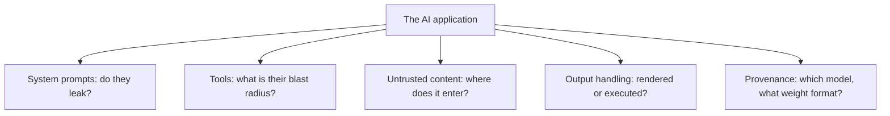

# Lab 11.5: AI System Security Review

**Month:** 11 (Cloud and AI System Security)
**Pattern family:** Cloud and AI attack surfaces
**Time budget:** 8 hours (across multiple sessions)
**Lab attempt floor:** multi-hour (this is a hard, open-ended lab; treat the first session as floor time and do not seek a walkthrough of your chosen application)
**AI guidance:** AI is both a drafting tool (for harness and report structure) and a subject of study. You choose the application, run it yourself, find the attack paths yourself, and write the review yourself. AI Provenance log mandatory. See "AI guidance for this lab."
**Prerequisites:** Lab 11.4 complete (you have demonstrated injection, indirect injection, and tool abuse). Month 10 (the pentest-report format: scope and authorization, methodology, findings with severity, recommendations). The Month 11 AI supply-chain reading. `AI-ETHICS.md` re-read.

**Recall first, from memory, before you read on:** in Month 10 you wrote a full pentest report. What were its main sections, in order? (You will reuse that exact structure here, on an AI application instead of a vulnerable machine.)

## The scope rule, first

You review **one open-source LLM application that you choose, download, and run yourself**, on your own machine or in your own account. It is authorized because it is your own deployment, the same basis as a VulnHub VM in Month 10. You do not review a hosted instance of someone else's deployment, a public demo, or a paid product. If the application calls a hosted model, it does so through your own key. The whole engagement happens inside infrastructure you own.

Choose an application that is genuinely open source and that you can run in full, so you can inspect its prompts, its tool definitions, its dependency list, and how it handles model files. Do not choose a product you can only reach as a hosted service. You cannot authorize testing of infrastructure you do not control.

`AI-ETHICS.md` rule 5 still governs. You are reviewing to find and describe weaknesses and their fixes, not to weaponize them and not to produce harmful content.

## Why this lab exists

This is the month's capstone, and the direct twin of Month 10's full-box writeups. In Month 10 you took a vulnerable machine end to end and reported it like a professional. Here you take an LLM application end to end and produce the same caliber of report, against the newest attack surface in the field. The deliverable, `ai-system-review.md`, is the artifact that shows a 2026 employer you can do AI security review work, which almost no entry-level candidate can.

The discipline is identical to a pentest: scope and authorization documented before any testing, a stated methodology, findings rated by severity with reproduction, and recommendations a maintainer could act on. Only the target class is new.

Before you attack anything, you map the same five surfaces on every AI application. Hold this checklist:


*Notice: these five questions are the reflex. The five findings you report will each come from one of these surfaces.*

## Learning objectives

By the end of this lab, you can:

- Scope and document the authorization basis for a security review of an LLM application you run yourself.
- Analyze an LLM application's architecture: its prompts, its tools and their permissions, its handling of untrusted and retrieved content, its output handling, and its model and dependency provenance.
- Identify and reproduce five distinct attack paths, each mapped to an OWASP LLM Top 10 (2025) category, against your own deployment.
- Assess the AI supply chain of the application: where its model comes from, whether the weights are in a code-executing format (pickle) or a safe one (safetensors), and what its dependency and model provenance imply.
- Rate each finding by severity with a defensible rationale, and write a recommendation a maintainer could implement.
- Produce a professional security review in the Month 10 pentest-report format, with an AI Provenance appendix.

## Recognition cue

When you are handed any AI application, you instinctively enumerate the same surfaces: the system prompt and whether it leaks, the tools and their blast radius, every place untrusted or retrieved content enters, how model output is used downstream, and where the model and the dependencies came from. This lab makes that enumeration a reflex and teaches you to report it like a professional.

## AI guidance for this lab

**AI as a drafting tool:** You may use AI to draft the harness you use to interact with the application, and to help structure the report (headings, severity-table format) the way you structured Month 10 reports. You own the structure and every claim in it.

**AI as a subject, not a substitute:** You choose the application, you analyze it, you find the five paths, you rate them, and you write the findings. You do not ask AI to "review this app and find the vulnerabilities," and you do not ask it to generate the attack payloads. The review is your work; the report carries your name and your judgment. As in Lab 4, you do not use a third AI to generate harmful content or to bypass any safety filter.

**Logged:** Your AI Provenance section (which becomes the report's appendix) records the drafting and structuring help honestly, and keeps it separate from your own analytical findings. A reviewer must be able to see what you found versus what AI helped you format.

This appendix is the public, portfolio version of your provenance discipline, and it feeds straight into Capstone D in Month 12. Be honest about how it is verified: in a full-enforcement tool the tutor checks it against your files on disk; in advisory mode (Copilot, a web agent) it is self-reported, so its integrity rests on you keeping it honest when nothing is watching (see the Month 11 README, "The verification ritual," and `AI-ETHICS.md` rule 1). The appendix is only worth what an interviewer will find when AI is closed and they ask you to defend a finding out loud.

## Tasks

### Task 1: Choose, run, and scope (90 minutes)

Choose an open-source LLM application you can run in full. Stand it up on your own machine or in your own account, with any hosted model accessed through your own key. Write the scope and authorization section of your review exactly as you did for a Month 10 engagement: what is in scope (your own deployment of this application, by name and version), what is out of scope (anyone else's instance, the upstream hosted model's own infrastructure), and the explicit statement that you own and are authorized to test this deployment.

**Checkpoint:** the application runs under your control, and a written scope-and-authorization section names the application and version and states the authorization basis.
**If not:** if you cannot run it in full, you cannot inspect its prompts, tools, and model files, so you cannot review it; pick a different open-source application you can deploy entirely yourself. The floor applies: do not go looking for a walkthrough of this application's weaknesses; the finding is yours to make.

### Task 2: Map the architecture and attack surface (90 minutes)

Before attacking, map the application as a defender would. Identify and document the five surfaces from the diagram above: the system prompt(s); every tool the model can call and the permissions each has; every place untrusted or external content enters the model's context (user input, retrieved documents, web content, tool results); how the model's output is consumed downstream (rendered as HTML, executed, used in a further query); and the model and dependency provenance (which model, from where, in what weight format, and what the dependency list pulls in).

**Checkpoint:** an architecture-and-surface document covers prompts, tools and their permissions, untrusted-content entry points, output handling, and provenance. This is the map your five findings will come from.
**If not:** if a surface is blank (say, you cannot find the system prompt), that gap is itself worth noting; search the code and config for where the prompt is set. A surface you skipped is a finding you will miss.

### Task 3: Find and reproduce five distinct attack paths (3 hours)

Identify five distinct attack paths against your deployment, each mapped to a different (or at least clearly distinguished) OWASP LLM Top 10 (2025) category. Reproduce each well enough to document it. Draw on the techniques from Lab 4 and extend them to this application's specifics. Candidate categories, depending on the application:

- Prompt injection, direct and indirect (LLM01).
- System prompt leakage (LLM07).
- Improper output handling, for example model output rendered or executed unsafely (LLM05).
- Excessive agency, for example a tool the model can be driven to misuse (LLM06).
- Sensitive information disclosure (LLM02).
- Supply chain, for example a model in pickle format or a risky dependency (LLM03).
- Unbounded consumption, for example no rate or cost limit on an expensive operation (LLM10).

Keep every attempt benign and aimed at your own canaries: reproduce the weakness, do not produce harm. Record verbatim payloads only in your private notebook; the report describes the technique.

**Checkpoint:** five distinct, reproduced attack paths exist, each tied to an OWASP LLM category and each with enough detail in your notebook to write a finding. At least one is an indirect-injection or supply-chain path.
**If not:** if your five paths all reduce to "prompt injection," they are one finding in five outfits. Use your Task 2 surface map: a leaked prompt (LLM07), an unsafe output (LLM05), and a misused tool (LLM06) are genuinely distinct paths.

### Task 4: Assess the AI supply chain (gradual release)

The one new mechanical skill in this lab is inspecting a model's weight format and provenance. You learn it in three stages. The worked example uses a benign model file, so you can focus on the technique safely.

#### Stage 1 - Worked example (I do): read a pickle without loading it

The danger of a pickle file is that loading it can run code. So you inspect it without loading it, using Python's `pickletools`, which reads the opcodes as text. On any small benign pickle file (even one you create with `import pickle; pickle.dump([1,2,3], open("demo.pkl","wb"))`), run:

```zsh
python -m pickletools demo.pkl
```

This prints the opcodes that make up the file. In a safe data-only pickle you will see opcodes like `EMPTY_LIST` and `APPEND`. The two to fear are `GLOBAL` (imports a Python name) and `REDUCE` (calls it), because together they are how a malicious pickle runs code on load. You just read a serialized file's intent without executing it. That is the core supply-chain skill: inspect, never blindly load.

**Checkpoint:** you ran `python -m pickletools` on a benign pickle and can name the two opcodes (`GLOBAL`, `REDUCE`) that signal code execution.
**If not:** if the command errors, confirm the file path and that it is actually a pickle. Read the Python `pickletools` docs; the point is that it reads opcodes without running them, which is exactly why it is safe to use on an untrusted file.

#### Stage 2 - Faded practice (we do)

Now apply the inspection to your application's model. Fill in the checks:

```
# Step 1: what weight format does the app's model use?
#   - .safetensors  -> safe, carries no code        -> TODO: confirm and note
#   - .bin/.pt/.ckpt (pickle) -> can execute on load -> TODO: if pickle, inspect with pickletools
# Step 2: provenance signals on the source hub
#   - is there a pickle-import scan shown?           -> TODO
#   - are commits signed? who is the publisher?      -> TODO
# Step 3: dependencies
#   - what does the dependency list pull in, and is anything unexpected? -> TODO
```

**Checkpoint:** you have determined your model's weight format, inspected it with `pickletools` if it is pickle, and noted the provenance signals available.
**If not:** if you cannot find the model file, check the app's config and cache directory for what it downloads; the format is in the file extension and the hub page.

#### Stage 3 - Independent (you do): write the assessment

No scaffolding now. Write the full supply-chain assessment for your application: the model's source and weight format (and the deserialization risk if it is pickle), the provenance signals available (scanner output, signing, publisher), and the dependency posture. Do not let the assessment collapse to "pickle bad, `safetensors` good": `safetensors` removes the load-time code-execution risk but is not a clean bill of health, because provenance, signing, and the dependency posture still matter, and other formats can carry code too (a Keras Lambda layer, for instance). Note also that hubs run layered scanners (an in-house scan plus third-party tools such as `picklescan`), not a single check, so "the hub scanned it" is a signal, not a guarantee. You do not need to find a live malicious model; you assess and document the provenance risk across format, provenance, and dependencies, as a real review would.

**Checkpoint:** a supply-chain assessment covers the model's source and weight format (with the deserialization risk if pickle), the provenance signals, and the dependency posture, written so a maintainer understands the risk even with no live malicious artifact present.
**If not:** if your model is `safetensors` from a signed, scanned source, that is a low-risk finding, and saying so clearly (with the evidence) is the right answer. A pickle model from an unsigned source is a real finding even with no payload in it today.

### Task 5: Write the review in the Month 10 format (2 hours, may overlap the deliverable)

Assemble `ai-system-review.md` in the pentest-report structure you used in Month 10:

- **Scope and authorization** (from Task 1).
- **Methodology** (how you approached the review: the surface map, the OWASP mapping, the supply-chain check).
- **Findings**, five of them, each with a severity rating and rationale, the affected component, a reproduction summary (technique, not a copy-paste exploit), and the OWASP LLM category.
- **Recommendations**, each tied to a finding and written so a maintainer could act on it.
- **AI Provenance appendix** (your provenance log, restructured as the report's appendix).

The full specification is in `../deliverable.md`; this task is where you produce it.

**Checkpoint:** a complete `ai-system-review.md` exists in the Month 10 report format, with five findings rated and reproduced, recommendations tied to findings, and an AI Provenance appendix. No verbatim harmful payloads; techniques described.
**If not:** if a finding has a severity label but no rationale, add the why; an unjustified rating is the tell of a junior report. If a recommendation is not tied to a specific finding, link it or cut it.

### Task 6: Notebook entry with AI Provenance (45 minutes)

Write `.tutor/notebook/lab-05-ai-system-review.md`. Required sections:

- **Pre-flight check** for the chosen application and any new tool: what it does, what artifacts your testing leaves, what could go wrong, and the authorization scope (your own deployment only).
- **Concept naming.**
- **Evidence:** the architecture map, the five findings in brief, the supply-chain assessment, a pointer to the full `ai-system-review.md`.
- **Five-question debrief.**
- **AI Provenance:** drafting and structuring help kept separate from your own analytical findings, with the specific verification you did on anything AI drafted.

**Checkpoint:** a committed entry has all sections, and the provenance makes clear the findings are your analysis, not AI's.
**If not:** if it reads as "AI found the vulnerabilities," the entry is rejected. The appendix should show AI helped format and structure, while you found and rated every finding.

## Definition of Done

You are done when all of these are true:

- The application runs under your control, with a written scope-and-authorization section (Task 1).
- An architecture-and-surface document covers all five surfaces (Task 2).
- Five distinct attack paths are reproduced and mapped to distinct OWASP LLM categories, at least one indirect-injection or supply-chain (Task 3).
- A supply-chain assessment covers weight format, provenance signals, and dependencies, with `pickletools` used if the model is pickle (Task 4).
- `ai-system-review.md` is written in the Month 10 format with an AI Provenance appendix (Task 5).
- The notebook entry is committed, with findings clearly your own (Task 6).

The tutor will run the verification ritual by selecting one finding and asking you to explain, from memory, the attack path at the level of the trust boundary, your severity rationale, and why your recommended mitigation is sufficient or only partial. A finding you cannot defend this way returns; the report is not done until every finding is yours.

**Self-explain:** in one sentence, why is a pickle-format model from an unsigned source a real finding even when the file you downloaded contains no malicious code today?

## Failure modes to expect

- You will be tempted to pick a popular application and read someone's existing review of it. That is the walkthrough trap in a new costume; the finding has to be yours. Pick something you will analyze fresh, and honor the floor.
- You will produce five findings that are really one finding (prompt injection) described five ways. They must be distinct paths mapping to distinct categories; that is what makes it a review rather than a single bug report.
- You will under-rate or over-rate severity to make the report look a certain way. Rate honestly with a defensible rationale; an inflated critical with weak justification is exactly the tell that separates a junior report from a credible one.
- You will skip the supply-chain assessment because no live malicious model is present. The assessment is about provenance and format risk; a pickle-format model from an unsigned source is a real finding even with no payload in it today.
- You will let verbatim payloads into the published report. Describe the technique; keep verbatim payloads in your private notebook. The report is a portfolio piece, not an exploit kit.

## Time budget breakdown

- Task 1: 90 minutes
- Task 2: 90 minutes
- Task 3: 3 hours
- Task 4: 60 minutes (Stage 1 ~15 min, Stage 2 ~15 min, Stage 3 the rest)
- Task 5: 2 hours (overlaps the deliverable)
- Task 6: 45 minutes
- Buffer: 60 minutes

Total: roughly 8 to 9 hours, with Task 5 shared with the deliverable.

## Stretch goals

1. If your application uses MCP for tools, assess one MCP-specific risk from the spec (tool poisoning, tool definition mutation, cross-server interference, or credential aggregation) and add it as a sixth finding or a methodology note.
2. Pick your highest-severity finding and write a short proof-of-concept fix (a code or config change) a maintainer could apply, then explain why it is or is not a complete mitigation.
3. Re-run your Lab 4 indirect-injection technique against this application's content-ingestion path, and report whether this app's defenses (if any) held where your own toy bot's did not.

## Troubleshooting

- **The application will not run locally.** You cannot review what you cannot run in full. Try its container image or a fresh virtual environment, and if it still will not run, choose a different open-source application; a hosted-only product is out of scope.
- **You cannot find the system prompt.** Search the source and config for where the prompt is set, including any prompt-template file. If it is truly hidden or remote, note that as part of the architecture map.
- **`python -m pickletools` errors on the model file.** Confirm the path and that the file is actually a pickle (a `.safetensors` file is not). For a `safetensors` model, the assessment is "no code-execution risk on load," which you state with evidence.
- **Your five findings collapse into one.** Re-read your Task 2 surface map. A leaked prompt, an unsafe output, a misused tool, and a supply-chain risk are distinct paths even if injection is the trigger for several.
- **A verbatim payload slipped into the report.** Move it to your private notebook. The report describes the technique; it is a portfolio piece, not an exploit kit.

## Resources

- _docs_ The OWASP Top 10 for LLM Applications (2025), the full list, as your finding taxonomy.
- _docs_ The OWASP Agentic Security Initiative "Threats and Mitigations" and the MAESTRO layered model (if your chosen application is agentic or multi-agent).
- _docs_ The Model Context Protocol specification and its security guidance (if your application uses MCP for tools and context): tool poisoning, tool definition mutation, cross-server interference, and human-in-the-loop.
- _docs_ HuggingFace's documentation on pickle scanning and on `safetensors` (for the supply-chain assessment).
- _reference_ Your own Month 10 pentest reports (for the format) and your Lab 4 attack record (for the techniques).
