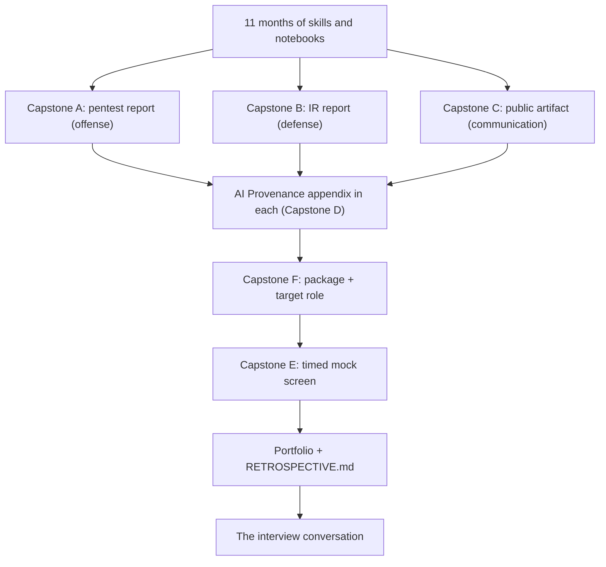

# Month 12: Capstone

**Pattern family:** Synthesis
**Time budget:** 80 hours
**AI guidance:** Full augmentation permitted, full provenance required. Every deliverable carries an AI Provenance appendix (Capstone D). This is the month where you show the AI fluency the last seven months built, in the form employers screen for.
**Prerequisites:** Months 0 through 11 complete. You have a working SIEM from Month 9, three pentest writeups from Month 10, a cloud and AI system review from Month 11, and the AI Provenance discipline as a reflex. If any prior month is unfinished, finish it before you start the capstone. The capstone assumes all of it.

## Why this month exists

For eleven months you built skills against labs the course chose for you. The capstone is different. Here you choose, scope, execute, and report an engagement the way a working practitioner does. No lab README tells you the answer is reachable. This is the difference between finishing exercises and doing the job.

It is also the work you hand a hiring manager. In 2026, an entry-level candidate who says "I finished a cybersecurity course" sounds like a thousand others. A candidate who says "here is a 20-page pentest report against a box I scoped and rooted myself, here is an incident report from a breach I investigated end to end, and here is a public writeup I published, each with an honest account of where AI helped and where I caught it being wrong" is a different conversation. The capstone produces that second candidate.

There are no new techniques this month. Everything you need, you already have. What you do not yet have is the experience of putting it all together, under your own direction, to a professional standard. That experience is the whole point.

*Notice: the tracks are not random projects. A, B, and C build the work and the AI honesty appendix; F packages it for the role you name; E rehearses defending it live. Together they answer the questions every entry-level interview asks, and they get the work looked at in the first place.*

## Warm-Up: Retrieve Before You Begin

Answer these from memory, in writing, before you read on. No peeking at earlier months. This pulls the whole year forward, because the capstone uses all of it at once.

1. From Month 5: what does the AI Provenance log record, and why does the tutor reject a shallow one?
2. From Month 9: name the four phases of the NIST 800-61 incident response lifecycle.
3. From Month 10: when you scope a pentest, what one document must exist before any tool touches the target?
4. From Months 3, 4, and 7: name one enumeration step you would run against an unknown host, and what its output tells you.
5. From Month 8: you crack a password hash during Capstone A and report it. Why does a sound password store use a deliberately slow hash (bcrypt, scrypt, Argon2) instead of a fast one like SHA-256, and what does that tell a defender to fix?
6. Across the whole year: which one pattern family do you feel weakest in right now? Name it precisely.

Check your recall

1. It records which AI tool you used, what you asked, what was generated, the specific verification you ran, and what you discarded as wrong. A shallow log ("used AI to help") teaches you nothing later and proves nothing about your judgment. From Month 5, the drafting pattern.
2. Preparation; detection and analysis; containment, eradication, and recovery; post-incident activity. From Month 9 defensive operations.
3. A written authorization basis: the exact target, why testing it is legal, and the scope. From Month 10, and enforced again here. No authorization note, no engagement.
4. Examples: a port and service scan (`nmap`) tells you what is listening and which versions; a web content scan (`ffuf` or `feroxbuster`) tells you what paths exist. From Months 3, 4, and 7.
5. A slow hash makes each guess expensive, so an attacker who steals the store can only try a few thousand candidates per second instead of billions; a fast hash like SHA-256 is built for speed and lets an attacker brute-force or run a wordlist cheaply. The fix you report to a defender: store passwords with a purpose-built slow hash (bcrypt, scrypt, or Argon2) and a per-password salt, never a bare fast hash. From Month 8.
6. There is no answer key for this one. Your honest answer is the seed of the `RETROSPECTIVE.md` weak-patterns section. Write it down now.

## What you produce

Five tracks, all required, plus a retrospective. Each track is specified in its own file under `tracks/`.

- **Capstone A: Full pentest report** (`tracks/capstone-a-pentest-report.md`). A retired HackTheBox box (medium or hard) or an unseen VulnHub VM, taken end to end: scoping with documented authorization, reconnaissance, enumeration, exploitation, post-exploitation, lateral movement where applicable, and a professional 15 to 25 page report.
- **Capstone B: IR report** (`tracks/capstone-b-ir-report.md`). A simulated breach in your Month 9 SIEM, investigated as a SOC analyst would, written up as a professional 10 to 15 page incident response report.
- **Capstone C: Public artifact** (`tracks/capstone-c-public-artifact.md`). At least one published, searchable, public written piece (a blog post or a retired-CTF writeup) is required; a contribution or polished repository may be added but does not replace it. Unless your target role is offensive, the required piece is a sanitized public version of your defensive (IR or detection) work.
- **Capstone E: Timed mock technical screen** (`tracks/capstone-e-mock-screen.md`). One 45-minute timed mock screen the tutor conducts against your own artifacts (5 technical, 5 behavioral, AI closed), followed by your written self-assessment. The tutor critiques your delivery; it never models the answers.
- **Capstone F: Portfolio package and target role** (`tracks/capstone-f-portfolio-package.md`). A named target role, a one-to-two-page role-targeted resume, a single public portfolio-index page with a thesis, and a public-profile pass that links your public artifacts.
- **Capstone D: AI Provenance appendix.** Not a separate deliverable. A mandatory appendix inside each of A, B, and C, in the same format you have used in every notebook entry since Month 5. Specified in `deliverable.md`.
- **`RETROSPECTIVE.md`.** A reflection on the full 12 months: your weak patterns, your strong patterns, a named target role, three problems you expect in interviews with a playbook for each, an honest read of the local job market, and a 6-month maintenance plan. Specified in `deliverable.md`.

Full specification of all of the above, including the written-authorization requirement and the retrospective, is in `deliverable.md`. Read it before you start any track.

## The authorization rule, up front, because it gates everything

`SAFETY.md` governs the capstone the same way it governs every offensive month. The rule: **you may only test systems you clearly own, or have explicit written permission to test.** This is your **authorization basis**, the short written record that proves you are allowed to attack the target.

For Capstone A, you write this down before any work. Before any reconnaissance. Before any scan. Before any tool touches the target. The note states the exact target, why testing it is legal, and the scope. The tutor checks that this note exists and is sound before it will discuss any work on Capstone A. No authorization note, no engagement.

The legal targets for Capstone A are narrow. They are listed in `tracks/capstone-a-pentest-report.md`: a retired HackTheBox box (which is explicitly authorized for write-ups once retired), a VulnHub VM you downloaded and run on your own hardware, or a deliberately vulnerable environment you built yourself.

> **Common misconception.** "It is obviously a lab, so I can skip the authorization note."
> **Reality.** The note is not paperwork; it is the deliverable's opening page and the habit the capstone certifies. A tester who scans before scoping is a tester with a short career. You write the note every time, including for a lab, because that is how you build the reflex you need for real work.

**Bug bounties are not recommended as capstone targets.** The scope is too narrow, the legal review depends entirely on one program's specific terms, and the risk of straying out of scope is real. A single request to an out-of-scope asset can turn authorized research into a legal matter. The capstone is the wrong place to take that risk. Use a target whose authorization is unambiguous.

## Learning objectives

By the end of this month, you can:

- Scope an engagement against a legal target and document the authorization basis in writing before any work begins.
- Execute a full pentest (recon through reporting) against a single host and produce a report a client would accept.
- Investigate a multi-stage intrusion in a SIEM and produce an incident response report that follows the NIST 800-61 lifecycle.
- Produce a public, searchable written artifact that survives the scrutiny of a stranger on the internet who knows more than you do.
- Disclose AI assistance in professional deliverables to a standard an employer reads as discipline, not weakness.
- Name a target role and package your body of work (a resume, a public portfolio index with a thesis, and a profile) so a hiring manager reads it as one coherent story.
- Sit a timed, end-to-end mock technical screen against your own portfolio, answer from memory with AI closed, and assess your own delivery honestly.
- Reconcile, in a retrospective, the gap between what the course taught and what you can actually do, and build a concrete plan to close it over the following six months.

## Recognition cue

When an interviewer says "walk me through an engagement you ran end to end," or "tell me about a time you investigated an incident," or "show me something you have published," you reach for these three artifacts. The capstone is where you build the answer to the questions every entry-level interview asks.

## How the 80 hours are spent

The capstone is large because it is real. Do not crunch it; a rushed capstone reads as rushed, and the reader can tell. A suggested allocation:

| Work | Hours |
| ---- | ----- |
| Capstone A: engagement and report | 30 to 36 |
| Capstone B: scenario, investigation, and report | 20 to 28 |
| Capstone C: public artifact | 12 to 16 |
| Capstone F: portfolio package and target role | 4 to 6 |
| Capstone E: timed mock screen | 2 to 3 |
| RETROSPECTIVE.md | 6 to 8 |

Total lands near 80. **You do not run both A and B at the top of their ranges.** One of them is your heavy, deep track (toward its ceiling) and the other is solid but lighter (toward its floor), and which one is heavy is your choice, tied to your target role (see the note below). A defensive target puts the deep hours into B; an offensive target puts them into A. The exact split is yours; the floor on the engagement work (the time you spend actually doing A and B before you write a word of the report) is non-negotiable and is stated in each track file.

This month spans more calendar time than the others, at a steady pace. That is expected. Treat A, B, and C as parallel work you rotate between, not a strict sequence. The report writing on A pairs well with the investigation on B, because writing one teaches you how to write the other. Capstone C is the lowest-pressure of those three and a good place to rest your offensive and defensive muscles between sessions on A and B. Capstone F (packaging) and Capstone E (the mock screen) come late, after A, B, and C are drafted, because both draw on the finished work.

### Rebalance toward your target role

The default split above leans slightly offensive, but the entry-level roles that hire in the highest volume are defensive: SOC analyst and detection-adjacent roles. Junior pure-pentest seats are scarcer and more competitive. So **you may make Capstone B the heavy, deeper track instead of Capstone A** if your target role (the one you name in Capstone F) is defensive. A learner targeting a SOC role should put the deep hours into the IR report and the defensive public writeup, not the pentest report; a learner targeting an offensive role does the reverse. The defensive artifacts get the same public-polish treatment as the offensive ones either way: Capstone C's required written piece defaults to a sanitized public version of your defensive work precisely so the defense does not stay private. Point your deepest work at the door you are actually knocking on.

## Week-1 warm-start: keep the year alive

Like every month since Month 2, Week 1 opens with a warm-start that re-runs a prior skill before the new work. Here it is bigger, because the capstone leans on the whole year. Before you scope a single track, do this: stand up your Month 9 SIEM and confirm it still ingests, re-run one Month 5 tool against your own host, re-read your Month 10 pentest writeups, and pull one Month 8 cryptographic primitive cold (re-annotate one message of your Month 8 TLS handshake, or re-derive from memory why a password store uses a slow hash). The Month 8 pull is deliberate: crypto is the one substantive month with the longest gap since you last touched it, and the password-hash and signature ideas surface in both Capstone A (cracked credentials, certificate findings) and a screen. You are not just dusting off tools. You are taking inventory of what you can do, which is exactly what the `RETROSPECTIVE.md` asks you to write down at the end.

## Core concepts to internalize

Read these to understand the capstone, not to memorize them. Each chunk is one idea. There are no new techniques here; these are the ideas that turn eleven months of skills into a portfolio.

### The report is the deliverable, not the root shell

The work you do under the hood must be real. But the **report** is the only thing a client or employer ever sees. A brilliant engagement written up badly is a failed deliverable. Anyone can follow a walkthrough to a root shell. Few entry-level candidates can write an engagement up so that a reader can reproduce it, understand the impact, and act on the fix. That writing is the skill the capstone certifies.

> **Common misconception.** "Once I root the box, the hard part is done."
> **Reality.** The root shell is roughly half the work. The report is the other half, and it is the half that gets you hired. Budget the full writing time, and do not let a fast root tempt you into a thin writeup.

### A finding needs severity, evidence, and a fix

Each finding in a report carries three things. A **severity**, scored with a defensible rubric (CVSS or a stated scale), not a vibe. The **evidence** that the finding is real, so a reader can confirm it. And a concrete **remediation**, the fix the target should apply. A finding without evidence is just an assertion. A finding without a fix is just a complaint. You met CVSS scoring in your reading; the capstone is where you apply it under your own judgment.

### AI is a fast junior, and you sign the work

> **Heavy concept ahead.** Slow down here; this is the load-bearing idea of the whole capstone.

For seven months you ran AI under discipline: spec first, AI drafts, your tests or your judgment decide, you own the result. The capstone removes the per-month limits and lets you combine every pattern. That freedom raises the stakes, it does not lower them. **You sign the report.** Every finding, every claim, every line of code is yours to defend from memory, with your AI session closed. The **verification ritual** is how the tutor checks this: it picks one finding, one paragraph, or one query at random and asks you to defend it. If AI carried you, you cannot, and that piece returns.

> **Common misconception.** "Disclosing that I used AI makes my work look weaker."
> **Reality.** It does the opposite. Disciplined, disclosed AI use is exactly the trait the 2026 entry-level market screens for hardest. Hidden AI use is the one employers distrust. The **AI Provenance** appendix (Capstone D) is the demonstration, not an admission. An employer who would penalize the honesty is telling you they prefer candidates who hide it.

### AI is most dangerously wrong about vulnerability claims

In offensive work, AI is most confidently wrong when it asserts a target is vulnerable to a specific **CVE** (a numbered public vulnerability record) based on a service banner. Banners lie. Back-ports exist. A version string is not the same as an affected version. Verify every such claim against the authoritative CVE record before you spend an hour chasing it. This is the same verification reflex the whole course built, now applied where it costs you the most time if you skip it.

## The AI augmentation posture this month

Full augmentation, full provenance. After eleven months you have run every augmentation pattern the course teaches: drafting (Month 5), concept orientation (Month 6), brainstorming variations (Month 7), detection-rule drafting (Month 9), recon synthesis (Month 10), IaC drafting (Month 11). The capstone lets you combine them freely. AI may help you draft report prose, summarize your own notes, suggest detection logic, brainstorm enumeration angles, and explain artifacts you do not recognize.

Four rules do not change, no matter how freely you use AI:

- **The scope rule is absolute.** AI does not generate exploit code against any target you do not own. AI is not jailbroken for "lab purposes." `AI-ETHICS.md` governs, exactly as it has since Month 5.
- **No client or sensitive data into public AI services.** On these labs that means no credentials, tokens, or keys from your target VM pasted into a public model. The lab being synthetic does not waive the habit you are building for real work.
- **You verify, then you own.** The verification ritual applies (see Core Concepts above). You defend any piece of any deliverable from memory, with AI closed.
- **Provenance is in the deliverable, not just the notebook.** Capstone D makes provenance a public-facing appendix.

Read `AI-ETHICS.md` again before you start. The disclosure section at its end is the standard Capstone D must meet.

## Notebook and provenance this month

You still keep your lab notebook. Each track gets a notebook entry at `.tutor/notebook/capstone-<a|b|c|e|f>.md` with the five-question debrief and an AI Provenance section, exactly as in every month since Month 5. For A, B, and C the provenance also appears in the deliverable itself, as Capstone D. For Capstone E the provenance records that the screen was run with AI closed; for Capstone F it logs the AI that helped you draft the resume and index. The notebook entry is your working log; the appendix is the polished, public-facing version of the same honesty.

The tutor still gates on the notebook. It will not consider a track complete until its notebook entry is committed, and for A, B, and C until the deliverable carries a Capstone D appendix that meets the standard in `deliverable.md`.

## Reflect

Spend ten minutes on these in your notebook, in writing, not just in your head. Do this before you scope your first track.

- **Explain it back:** in two or three sentences, explain to a peer who just finished Month 11 why the report, not the root shell, is the deliverable.
- **Connect:** how does the AI Provenance appendix (Capstone D) extend the AI Provenance log you have written in every notebook entry since Month 5? What is the same, and what is new?
- **Monitor:** of the five tracks, which feels hardest to you right now? Name the specific skill you are unsure about, and write the one question that would settle it.

## Knowledge Check

Answer from memory first, then check. Items marked ⟲ are spaced callbacks to earlier months and are supposed to feel like a stretch.

1. Why is the report the deliverable, and not the root shell or the proof string?
2. Name the three things every finding in a report must carry.
3. What goes in the Capstone A authorization basis, and when do you write it?
4. Why are bug bounties not recommended as a Capstone A target?
5. What is the verification ritual, and what happens if you cannot pass it on a finding?
6. A report says "the attacker moved laterally at 14:32." What is missing that turns this claim into a finding?
7. ⟲ From Month 5: what are the elements of an AI Provenance entry, and why is "used AI to help" rejected?
8. ⟲ From Month 9: what are the four phases of the NIST 800-61 lifecycle, and which one does the IR report's "lessons learned" section belong to?
9. ⟲ From Month 10: why must you pick a box you have *not* seen for Capstone A?
10. AI tells you the target runs a version vulnerable to a specific CVE, based on a banner. What do you do before chasing that lead, and why?

Answer key

1. The report is the only thing a client or employer ever sees, and writing an engagement up so a reader can reproduce it and act on it is the rare skill. The flag or shell proves nothing to a reader.
2. A severity (scored with a defensible rubric), the evidence that it is real, and a concrete remediation.
3. The exact target, why testing it is legal (with a citation), and the scope (what is in and out). You write it before any reconnaissance, scan, or tool touches the target, and the tutor verifies it first.
4. The scope is too narrow, the legal review depends on one program's specific and changeable terms, and a single out-of-scope request can convert authorized research into a legal matter. A retired box or VulnHub VM gives an unambiguous basis instead.
5. The tutor picks one finding, paragraph, query, or line of code and asks you to defend it from memory with AI closed. If you cannot, that piece returns until you can.
6. The evidence. "At 14:32, evidenced by event ID 4624 logon type 3 from HOST-A to HOST-B with account svc-backup" is a finding; the bare claim is not.
7. Which AI tool, what you asked, what was generated, the specific verification you ran, and what you discarded as wrong. "Used AI to help" lets neither you nor a reader reconstruct or judge the work. From Month 5.
8. Preparation; detection and analysis; containment, eradication, and recovery; post-incident activity. "Lessons learned" is the post-incident activity phase. From Month 9.
9. The capstone is an engagement under your own direction, with no prior knowledge that the answer is reachable. A box you watched a walkthrough of is a recital, not an engagement. From Month 10.
10. Verify the installed version against the authoritative CVE record's affected-version range before chasing it. Banners lie and back-ports exist, so a version string is not the same as an affected version, and a false lead costs hours.

## How to know you are done with this month

- Capstone A delivered: a 15 to 25 page pentest report against a legal target, with the authorization basis and engagement dates documented, an Assumptions and Limitations section and a confidentiality notice present, a Capstone D appendix, and no CTF flags in it.
- Capstone B delivered: a 10 to 15 page IR report on a breach you simulated and investigated in your Month 9 SIEM, with a confidentiality notice, stated investigation bounds, and a Capstone D appendix.
- Capstone C delivered: at least one public, searchable written piece (a blog post or a retired-CTF writeup, sanitized), with AI assistance disclosed per `AI-ETHICS.md`. A contribution or repo may be added but does not replace the written piece.
- Capstone E delivered: one 45-minute timed mock screen sat in one sitting with AI closed, the tutor's feedback taken, and your written self-assessment committed.
- Capstone F delivered: a named target role with a positioning statement, a role-targeted resume, a public portfolio-index page with a thesis, and a public-profile pass that links your public artifacts.
- `RETROSPECTIVE.md` committed: weak patterns, strong patterns, a named target role, three interview problems with playbooks, an honest local-market read, and a 6-month maintenance plan.
- Five notebook entries committed (`capstone-a.md`, `capstone-b.md`, `capstone-c.md`, `capstone-e.md`, `capstone-f.md`), each with a complete AI Provenance section.
- You can pass the verification ritual on any finding, paragraph, query, line of code, or resume claim in any of the deliverables.
- `.tutor/progress.md` updated to "Month 12 complete; course complete."

If any track is rushed, any authorization basis undocumented, the required public writeup missing, or any Capstone D appendix missing or shallow, the capstone is not done. This is the artifact that represents the whole course; hold it to that bar.

## Resources

Curated, light, and report-craft focused in `reading.md`. By Month 12 your primary resource is your own eleven months of notebooks; the reading list points to the reporting standards and disclosure templates that turn good work into a good deliverable.
