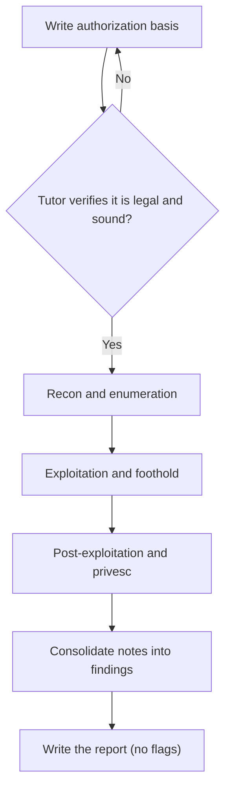

# Capstone A: Full Pentest Report

**Month:** 12 (Capstone)
**Pattern family:** Synthesis (offensive)
**Time budget:** 30 to 36 hours (engagement plus report; across many sessions). If your target role (Capstone F) is offensive, this is your heavy track and you run toward the high end; if it is defensive, you run A nearer the low end and put the deep hours into Capstone B instead. See the rebalancing note in the Month 12 README. The 6-hour engagement floor below is non-negotiable either way.
**Lab attempt floor:** Multi-hour. The engagement is the floor: you may not open a public walkthrough, another learner's writeup, or an AI session for help solving the box until you have spent at least 6 hours working it yourself. This is the hardest floor in the course because the target is real. It is also the most important, because the engagement is the deliverable.
**AI guidance:** Full augmentation, full provenance. AI may help you draft report prose, summarize your own enumeration notes, explain an artifact you do not recognize, and brainstorm angles you have not tried. AI may not generate exploit code against the target, choose your approach for you, or be opened for solving help before the 6-hour engagement floor. Every use goes in the Capstone D appendix. See "AI guidance for this track" below.
**Prerequisites:** Month 10 complete (you have rooted boxes and written pentest reports before). Months 3, 4, 7 (networking, packet analysis, web) as the substrate of enumeration and exploitation. `SAFETY.md` and `AI-ETHICS.md` re-read.

**Recall first, from memory, before you read on:** in Month 10 you rooted three boxes the course chose for you, and you wrote three reports. What was the path like, and did you know going in that each box was solvable? (Hold the answer in your head. The capstone removes exactly that safety net: an unseen target, under your own direction, with no promise the answer is reachable.)

## The scope rule, first, because it gates everything

You run this engagement against **one** legal target and nothing else. Before any reconnaissance, before any scan, before any tool touches the target, you write down the authorization basis (specified below and in `deliverable.md`) and commit it to your engagement notes. The tutor verifies this before it will discuss any work on this track. No authorization note, no engagement. This is not optional and it is not negotiable; it is the exact discipline that separates a penetration tester from a CFAA defendant.

**Legal targets for Capstone A, and only these:**

- A **retired** HackTheBox box, medium or hard difficulty. HackTheBox explicitly authorizes write-ups of retired boxes; active boxes are off limits for write-ups and you do not use one. You cite the retirement and the write-up policy in your authorization basis.
- A **VulnHub VM** you have not seen before, downloaded and run on your own hardware. VulnHub VMs are published as deliberately vulnerable targets for exactly this purpose.
- A **deliberately vulnerable environment you built yourself**, on a host you own.

**Out of scope, in every framing:** any active HTB box, any other learner's box, the HTB or VulnHub infrastructure itself, the VPN gateway, any other service on your own host, anything on your home network, and (per `SAFETY.md` and the `deliverable.md`) any bug bounty target. Bug bounties are not recommended capstone targets. The scope is too narrow, the legal review depends on one program's specific terms, and the risk of straying out of scope is too high. Use an unambiguous target.

Pick a box you have **not** seen. The point of the capstone is an engagement you scope and solve under your own direction, with no prior knowledge that the answer is reachable. A box you watched a walkthrough of last month is not a capstone; it is a recital.

## Why this track exists

In Month 10 you rooted three boxes and wrote three reports, but the course chose the boxes and the path was a known-good one. Capstone A removes the training wheels: you choose a medium-or-hard target you have never seen, scope it, and take it end to end to a report a client would accept. This is the closest thing the course offers to a real first engagement, and it is the artifact a hiring manager for an offensive role asks to see.

The report is the deliverable, not the root shell. Anyone can follow a walkthrough to a flag. Few entry-level candidates can write up an engagement so that a reader can reproduce it, understand the impact, and act on the remediation. That writing is the skill this track certifies.

## Learning objectives

By the end of this track, you can:

- Produce a written authorization basis for a target before any work, and defend why the target is legal.
- Execute a full engagement against a single host: reconnaissance, enumeration, exploitation, post-exploitation, privilege escalation, and lateral movement where the target presents it.
- Maintain engagement notes detailed enough to reconstruct every step weeks later, with timestamps and command output.
- Assign defensible severity to each finding using CVSS or a stated rubric.
- Produce a professional 15 to 25 page pentest report with an executive summary, a methodology section, findings with evidence and remediation, and appendices, containing no CTF flags.
- Disclose AI assistance in a Capstone D appendix to the standard in `AI-ETHICS.md`.

## Recognition cue

When an interviewer says "walk me through an engagement you ran end to end, including how you scoped it," this report is your answer. Capstone A is where you build the artifact and the story that answer requires.

## The shape of the engagement

Here is the flow you will follow, and the gate that comes first. Every phase feeds your engagement notes, and the notes feed the report.

*Notice: the gate is first and it is hard. Nothing downstream starts until the authorization basis passes. The report at the end is built only from the notes you kept along the way, which is why the notes matter as much as the shells.*

## AI guidance for this track

Full augmentation, with the floor and the scope rule absolute.

**Allowed.** After the 6-hour engagement floor, AI may summarize your own enumeration output ("here are my nmap and ffuf results; what stands out"), explain an artifact you do not recognize ("what does this service banner indicate"), suggest enumeration angles you have not tried, and draft and tighten report prose. The recon-synthesis pattern from Month 10 is your model: AI summarizes what you found, it does not find it for you.

**Not allowed.** Opening AI (or any walkthrough) for solving help before the 6-hour floor. Asking AI to generate exploit code against the target. Letting AI choose your approach so that you cannot explain why you took the path you took. Pasting credentials, hashes, keys, or other secrets harvested from the target into a public AI service (this would violate `AI-ETHICS.md` rule 4 even though the target is a lab; the habit is what matters). Jailbreaking a model for "lab purposes" (rule 5).

**Logged.** Every AI interaction goes in the Capstone D appendix, including the ones where AI was wrong. "AI claimed the version banner indicated a known RCE; I checked the actual affected-version range and the installed version was not in it, so I discarded that lead" is the kind of entry that proves you are the senior reviewing the junior.

A note on AI confidence in offensive work: AI is most dangerously wrong when it asserts a target is vulnerable to a specific CVE based on a banner. Banners lie, back-ports exist, and version strings are not the same as affected versions. Verify every such claim against the authoritative CVE record before you spend an hour chasing it. This is the verification skill the whole course built.

## Tasks

Do these in order. The engagement (Tasks 1 to 5) comes before any report writing (Task 6). The acceptance criteria are the bar; the steps are yours.

### Task 1: Target selection and written authorization (1 to 2 hours)

Choose your target from the legal list above. Then write the authorization basis described in `deliverable.md`. It states the exact target; the legal basis, with a link to the HTB retired-box policy or the VulnHub page; the scope (the target VM and only the target VM, with the out-of-scope items named); the engagement window (the dates during which you will test), and your name. The engagement dates carry into the report's Scope section, so record them here. Commit it to your engagement notes before anything else.

**Acceptance:** A dated `authorization-basis.md` in your engagement notes naming the exact target, the legal basis with a citation, and the explicit scope. The tutor verifies this is a legal target and a sound basis before you proceed. Until it is verified, you do not scan.

**Checkpoint:** the tutor confirms your authorization basis is sound, names a legal target, and states the scope.
**If not:** if the tutor rejects it, the usual causes are a vague target ("a HackTheBox box" instead of the box's name and retirement date), a missing citation for the legal basis, or an unstated scope. Add the missing piece and resubmit. You do not run a single command until this passes.

### Task 2: Reconnaissance and enumeration (6 to 7 hours)

Run the engagement's recon and enumeration phase: host discovery, port and service scanning, service enumeration, web enumeration if the target presents a web surface, and a full inventory of the attack surface. Keep timestamped notes of every command and its output. **The 6-hour engagement floor lives here and in Task 3:** no walkthroughs and no AI solving help until you have put in the time.

**Acceptance:** Engagement notes documenting the full attack surface: open ports, identified services and versions, enumerated web content or shares, and a ranked list of the most promising leads with your reasoning for the ranking. This is the raw material the report's methodology section is built from.

**Checkpoint:** your notes show a complete attack surface and a ranked lead list, each lead with one line on why you ranked it where you did.
**If not:** if you have a wall of raw scan output but no ranking, you have data, not analysis. Re-read your own output and ask "which of these is most likely to give a foothold, and why." That reasoning is what the report's methodology section reports.

### Task 3: Exploitation and initial foothold (6 to 9 hours)

Work the leads from Task 2 to a foothold. Document what you tried, what failed and why, and what finally worked. Capture the evidence (command output, screenshots) at each step. If you exhaust your own ideas after the 6-hour floor has elapsed, the hint ladder and AI synthesis are available; the engagement notes must still show your own attempts first.

**Acceptance:** A documented initial foothold (a shell or equivalent access) with the full chain recorded: the vulnerability, how you confirmed it, how you exploited it, and the evidence. Dead ends are documented too; a report that hides the failed attempts is less useful than one that explains them.

**Checkpoint:** you have a foothold and your notes record the full chain from vulnerability to access, plus the dead ends you tried first.
**If not:** if you are stuck past the 6-hour floor, the hint ladder and AI synthesis are now available, but your notes must already show your own attempts. If AI asserts a CVE will work, verify the installed version is in the affected range before you spend an hour on it (see "AI guidance for this track").

### Task 4: Post-exploitation and privilege escalation (4 to 6 hours)

From the foothold, enumerate for privilege escalation and execute it. Document the privesc vector, the evidence that it was exploitable, and the steps. If the target presents lateral movement (a second host, a pivot, stored credentials that reach further), pursue it and document it; if it does not, say so in the report rather than inventing it.

**Acceptance:** Documented privilege escalation to the highest privilege the box offers, with the vector, evidence, and steps recorded. Lateral movement documented where the target presents it; explicitly noted as not applicable where it does not.

**Checkpoint:** you have escalated to the highest privilege the box offers, and your notes record the vector, the evidence, and the steps.
**If not:** if you have a foothold but cannot escalate, enumerate again from the new vantage point; privesc vectors (sudo rules, SUID binaries, writable services, stored credentials) often only appear once you are on the box. If the box has no second host, write "lateral movement: not applicable" rather than inventing one.

### Task 5: Engagement notes consolidation (2 hours)

Before you write the report, consolidate your engagement notes into a clean timeline and a findings list. For each finding: what it is, where it lives, how you confirmed it, the impact, and a candidate severity. This is the bridge between the messy reality of the engagement and the clean structure of the report.

**Acceptance:** A consolidated timeline and a findings list, each finding with a candidate CVSS score or rubric severity and a one-line impact statement. No flags in the findings list; document the access you achieved, not the proof string.

**Checkpoint:** every finding on your list has a severity, a one-line impact, and a pointer to the evidence in your notes.
**If not:** if a finding has no evidence pointer, you cannot defend it later, so it is not a finding yet; either find the evidence in your notes or cut it. If a severity feels like a guess, open the CVSS calculator and score the vector string instead of picking a number by feel.

### Task 6: Write the report (10 to 13 hours)

Write the 15 to 25 page pentest report. Structure (PTES is the model; see `reading.md`):

- **Confidentiality and handling notice.** A one-line statement, near the top, that the report is confidential to its intended recipient and should be handled accordingly. A real engagement report always carries one; on a lab target it is practice, but a hiring manager who has seen real deliverables reads its presence as a sign you have.
- **Executive summary.** For a non-technical manager. What you were authorized to test, what you found at a glance, the overall risk, and the top recommendations. One page.
- **Scope and authorization.** The target, the authorization basis, the explicit engagement dates (the window during which testing occurred), and what was in and out of scope. This is where your Task 1 document becomes the report's opening. The dates are required, not optional: a real report always states when testing happened.
- **Assumptions and Limitations.** What the engagement assumed and what bounded it: the time-box (testing was limited to the hours you spent), whether testing was credentialed or uncredentialed, what was and was not tested, and the standard caveat that **absence of a finding is not proof of security.** This is the section that separates a candidate who has seen a real report from one who has only done CTF writeups; a real report always scopes its own confidence.
- **Methodology.** How you approached the engagement, phase by phase. A practitioner reads this to understand your process.
- **Findings.** Each with a severity (CVSS or rubric, with the rationale), the evidence, the impact, and a concrete remediation. Ordered by severity.
- **Conclusion and remediation roadmap.** What the target should fix first, second, third.
- **Technical appendices.** Command output, longer evidence, the full timeline.
- **Appendix: AI Provenance (Capstone D).** Per `deliverable.md`. One to two pages.

Meet the professional-report standard in `deliverable.md`: audience layering, evidence and remediation on every finding, reproducibility, clean prose, no em dashes, and no flags.

This track is a project spec, not a step-by-step lab, so there is no solved engagement here to copy. What helps instead is a model of the *shape* a single finding should take. Study this worked example. It is a made-up finding on a fictional host, deliberately not your box, so you copy the structure and not an answer.

> **Finding 2: Default credentials on the admin panel (Critical)**
>
> **Severity:** Critical (CVSS 9.8, vector `AV:N/AC:L/PR:N/UI:N/S:U/C:H/I:H/A:H`). Rationale: reachable over the network with no prior access, trivial to exploit, and full control of the application follows.
>
> **Description.** The web admin panel at `https://example-host/admin` accepts the vendor default credentials `admin:admin`. These were never changed after install.
>
> **Evidence.** Login succeeded with `admin:admin`; see Appendix C for the request and the resulting authenticated session. The login banner identifies the product and version, which ships with this default documented in the vendor manual.
>
> **Impact.** An attacker who reaches the panel gains full administrative control of the application, including the ability to read all stored records and add new admin users.
>
> **Remediation.** Change the default credentials immediately. Enforce a password policy and, where supported, multi-factor authentication on the admin panel. Restrict the panel to an internal network or VPN if it does not need to be public.

Notice what the example does: it names the severity *with a rationale*, ties every claim to evidence a reader could check, separates impact (what an attacker gains) from remediation (what the defender does), and contains no flag. Every finding in your report follows this shape. Your content is your own; the structure is the model.

**Acceptance:** A 15 to 25 page report meeting the professional standard, with all sections above, including a substantive Capstone D appendix and zero CTF flags. Exported to PDF for the portfolio.

**Checkpoint:** your report has all the sections listed (including the confidentiality notice, the engagement dates, and the Assumptions and Limitations section), every finding follows the shape modeled above, and a text search for your platform's flag format returns nothing.
**If not:** if a finding is missing evidence or a fix, it reads as an assertion or a complaint; add the missing half. If the executive summary uses the same technical language as the body, rewrite it for a non-technical manager. If there is no Assumptions and Limitations section, add one; a report with no stated limits reads as if you believe you found everything, which no real tester claims. If you find a flag string, remove it; the report documents how you rooted the box, not the proof.

### Task 7: Notebook entry (1 hour)

Write `.tutor/notebook/capstone-a.md`: the five-question debrief plus an AI Provenance section (the working version of what becomes Capstone D). Treat the debrief's fifth question seriously: what would you do differently on the next engagement, knowing what this one taught you.

**Acceptance:** A committed notebook entry with the five-question debrief and a complete AI Provenance section. The tutor will not mark Capstone A complete without it.

**Checkpoint:** the entry is committed with both the five-question debrief and a substantive AI Provenance section.
**If not:** if your provenance section is one line, the tutor rejects it. The test is whether a reader could reconstruct how you used AI from your notes, including the times AI was wrong and you discarded its answer.

## Definition of Done

You are done with Capstone A when all of these are true:

- The authorization basis was written and tutor-verified before any scan.
- The engagement is documented end to end in your notes: recon, foothold, privesc, and dead ends, with timestamps and evidence.
- The report is 15 to 25 pages, meets the professional standard, has every required section (including the confidentiality notice, the engagement dates in Scope, and the Assumptions and Limitations section), and contains zero CTF flags.
- The Capstone D AI Provenance appendix is present and substantive.
- The notebook entry is committed, and you can pass the verification ritual on any finding.

**Self-explain:** in one sentence, why does writing the authorization basis *before* any scan protect you in a way that writing it afterward never could?

## Verification

Capstone A is complete when: the authorization basis was documented and verified before work began, the engagement was executed and documented end to end, the report meets the 15-to-25-page professional standard with no flags, the Capstone D appendix is substantive, and the notebook entry is committed.

The tutor runs the verification ritual: it selects one finding and asks you to explain the vulnerability, why your severity is defensible, and how you exploited it, from memory, with your AI session closed. It may instead pick one paragraph of report prose and ask which raw evidence supports each claim. If you ran the engagement yourself, this is straightforward. If you leaned on a walkthrough or let AI carry you, it is not, and the report returns.

## Failure modes and troubleshooting

- **Skipping the authorization note "because it is obviously a lab."** The note is the deliverable's opening and the habit the capstone certifies. Write it first, every time. A pentester who scans before scoping is a pentester with a short career.
- **Picking a box you have already seen.** The temptation to use a familiar box for a smoother run defeats the purpose. The capstone is an engagement under your own direction; pick an unseen target and let it be hard.
- **Chasing an AI-asserted CVE without checking the affected-version range.** You will lose hours. Verify the version is actually in scope of the CVE before you commit to the lead.
- **Treating the root shell as the finish line.** The engagement is half the work; the report is the other half and the part that gets you hired. Budget the full 10 to 13 hours for writing, and do not let a successful root tempt you into a thin writeup.
- **Putting a flag in the report.** Capstone A documents methodology and findings. The flag proves nothing to a reader and signals you think the proof string is the point. Leave it out. (The tutor does not confirm flags; do not ask it to.)
- **Stuck on enumeration with nothing promising.** Slow down and enumerate wider, not just deeper: every open port, every virtual host, every directory. Most "unsolvable" boxes have a service you scanned past. Re-read your own output before you reach for a hint.
- **The report balloons past 25 pages.** You are likely pasting raw output into the body. Move long output to the technical appendices and keep the findings section tight: one finding, the evidence pointer, the impact, the fix.
- **Omitting the Assumptions and Limitations section.** A report with no stated limits reads as if you believe you tested everything and found everything, which no real tester claims. State the time-box, what was and was not tested, and that absence of a finding is not proof of security. This is the polish that separates a real report from a CTF writeup.

## Time budget breakdown

- Task 1 (target and authorization): 1 to 2 hours
- Task 2 (recon and enumeration): 6 to 7 hours
- Task 3 (exploitation): 6 to 8 hours
- Task 4 (post-exploitation and privesc): 4 to 5 hours
- Task 5 (notes consolidation): 2 hours
- Task 6 (report): 10 to 11 hours
- Task 7 (notebook): 1 hour

Total: 30 to 36 hours, depending on how hard the box fights you. If the engagement runs long, the report is where you make up time only by being efficient, never by cutting the professional standard. This is the offensive heavy track; if your target role is defensive, run nearer the floor and make Capstone B your deep track instead.

## Stretch goals

These are optional and only after the report meets the bar. Do not let them delay the deliverable.

1. Add a remediation roadmap that sequences the fixes by effort and impact, so a defender with limited time knows what to do first.
2. Write a one-page "detection guidance" appendix: for your top finding, what log event or alert would have caught the attack. This connects your offensive work to the defensive Capstone B.
3. Map each finding to a MITRE ATT&CK technique, the way Capstone B maps its scenario. Naming the technique sharpens both the report and your interview vocabulary.
4. Re-score one finding with a different stakeholder in mind (for example, a regulated environment where availability is paramount) and explain how and why the severity shifts.

## Resources

- The PTES reporting section and a published sample pentest report (see `reading.md`), for structure.
- The FIRST CVSS specification, for defensible severity scoring.
- `man nmap`, and the documentation for whatever enumeration and exploitation tools you reach for. By now these are familiar; the capstone is not the place to learn a new tool from scratch.
- Your own Month 10 pentest writeups and notebook entries. They are the template you are now leveling up to a client-grade report.
- `SAFETY.md` ("The capstone special case") and `AI-ETHICS.md` ("Disclosure in deliverables"), the governing documents for scope and for the Capstone D appendix.
