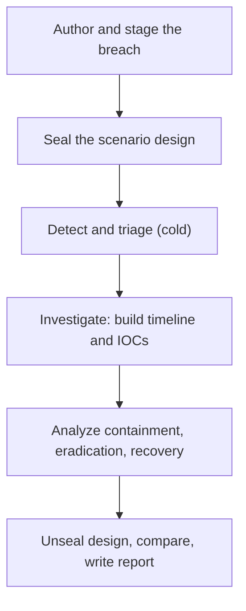

# Capstone B: Incident Response Report

**Month:** 12 (Capstone)
**Pattern family:** Synthesis (defensive)
**Time budget:** 20 to 28 hours (scenario, investigation, and report; across several sessions). If your target role (Capstone F) is defensive (SOC, detection), this is your heavy track and you run toward the high end, going deeper on the investigation and the detection recommendations; if your target role is offensive, you run B nearer the low end and make Capstone A your deep track. See the rebalancing note in the Month 12 README.
**Lab attempt floor:** Multi-hour. The investigation is the floor: once the breach is staged, you may not consult a walkthrough or open an AI session for analysis help until you have spent at least 4 hours investigating the logs yourself. The investigation is the deliverable; the report writes the investigation up.
**AI guidance:** Full augmentation, full provenance. AI may help you summarize log volumes, draft detection queries, explain an artifact, and draft report prose. AI may not investigate the incident for you before the 4-hour floor, and it does not get to decide what happened. Every use goes in the Capstone D appendix. See "AI guidance for this track" below.
**Prerequisites:** Month 9 complete, with a working SIEM (Wazuh or Security Onion) you can still stand up and ingest into. Months 6 and 7 (Windows and web logs) as the source material for a realistic breach. `AI-ETHICS.md` re-read.

**Recall first, from memory, before you read on:** in Month 9 you investigated a simulated incident on a platform that wrote the scenario for you. What did you have to do to turn raw log events into a timeline? (Hold the answer. Here you both author the breach and investigate it, so you see the attacker's side and the defender's side of the same evidence.)

## Why this track exists

In Month 9 you investigated a simulated incident on a platform that wrote the scenario for you. Capstone B closes the loop. You author the breach scenario and stage it in your own SIEM. Then you investigate it the way a SOC analyst arrives at it, cold. Then you write the incident response report. Authoring the scenario teaches you what an attacker leaves behind. Investigating it teaches you to find that evidence. Writing it up teaches you to explain it to the people who decide what to do next. This is the defensive counterpart to Capstone A, and the artifact a hiring manager for a SOC or detection role asks to see.

The report is the deliverable. Some analysts can find the intrusion but cannot write a timeline a manager trusts. A full analyst also produces IOCs another analyst can hunt on and recommendations an engineer can act on. Capstone B certifies that whole skill.

## A note on authoring your own scenario

You build the breach yourself, ideally with a study partner so the investigation has an element of the unknown. The scenario uses **only systems you own**: your Month 6 domain controller and member workstation, your Month 7 web application, all running on your own hardware, all ingesting into your own SIEM. There is no external target and no authorization question here, because every system involved is yours. The activity you simulate is adversary behavior against your own lab, generated by you, captured by your own logging. This is squarely inside `SAFETY.md`: your own machines are always a legal target.

If you work with a study partner, one of you stages the breach and the other investigates, then you swap. If you work alone, stage the breach over several separate sessions. Let enough time pass that the staging is no longer fresh in your mind. The goal is to investigate from the evidence, not from memory of what you did.

## Learning objectives

By the end of this track, you can:

- Author a realistic multi-stage breach scenario mapped to MITRE ATT&CK techniques, staged in a SIEM on systems you own.
- Investigate an intrusion from logs alone: establish initial access, trace the attacker's actions, identify what was reached, and build a defensible timeline.
- Extract indicators of compromise (IOCs) an analyst could hunt on, with the evidence for each.
- Structure an investigation and a report around the NIST 800-61 incident response lifecycle.
- Produce a professional 10 to 15 page IR report with an executive summary, a timeline, IOCs, root cause, and recommendations.
- Disclose AI assistance in a Capstone D appendix to the standard in `AI-ETHICS.md`.

## Recognition cue

When an interviewer says "tell me about a time you investigated an incident, from first alert to final report," this is your answer. Capstone B builds the artifact and the narrative that answer needs.

## The shape of the track

You play two roles in sequence. First you are the attacker who stages the breach and seals the design. Then you are the SOC analyst who arrives cold and rebuilds what happened from the logs alone.

*Notice: the design is sealed before you investigate. The whole skill is rebuilding the truth from evidence, not from memory of what you staged. The gap between your timeline and the sealed design is itself a finding.*

## AI guidance for this track

Full augmentation, with the investigation floor absolute.

**Allowed.** After the 4-hour investigation floor, AI may summarize a high-volume log slice ("here are 500 lines of auth events; what patterns stand out"), draft a detection query you then validate (the detection-rule-drafting pattern from Month 9), explain an artifact you do not recognize ("what does this Windows event ID indicate"), and draft and tighten report prose. AI may also help you brainstorm the scenario design before you stage it.

**Not allowed.** Opening AI (or a walkthrough) for investigation help before the 4-hour floor. Letting AI tell you what happened so that you cannot defend the timeline yourself. Pasting real PCAPs from your home network, or any real credentials or secrets, into a public AI service (`AI-ETHICS.md` rule 4; lab data with secrets is explicitly named there). The log data you generated in your lab is synthetic and lab-scoped, but redact anything that resembles a real secret before it goes anywhere public.

**Logged.** Every AI interaction goes in the Capstone D appendix, including discards. "AI summarized the auth log and asserted the failed logons indicated a brute force; I checked the timing and source and they were a single misconfigured service retrying, not an attack, so I corrected the timeline" is a strong entry: it proves you investigated, AI assisted, and you were the one who decided.

A note on AI in detection work: AI drafts plausible detection queries that are subtly wrong (matching too broadly, missing a field, assuming a log format you do not have). Validate every AI-drafted query against your actual log source and against a clean baseline before you trust its output in the report. This is the Month 9 discipline applied at capstone scale.

## Tasks

Do these in order. The scenario is staged (Task 1) before the investigation (Tasks 2 to 4), and the investigation comes before the report (Task 5).

### Task 1: Author and stage the breach scenario (4 to 6 hours)

Design a multi-stage breach against your own lab and map each stage to MITRE ATT&CK. A realistic scenario has an initial access vector (a phished credential, an exposed service, a web vulnerability from your Month 7 app), a foothold, some discovery and lateral movement, and an objective (data the attacker reaches, persistence the attacker establishes). Stage it: generate the activity on your own systems so your SIEM captures it. Confirm the logs landed.

**Acceptance:** A scenario design document (the attacker's intended path, mapped to ATT&CK techniques) and a SIEM that has ingested the staged activity. The design document is sealed before you investigate; you do not consult it during the investigation. If working with a partner, the partner stages and you do not see the design.

**Checkpoint:** your SIEM shows the staged activity in its logs, and your design document is sealed (committed and set aside, or held by your partner).
**If not:** if the activity is not in the SIEM, the logs did not land; confirm the agent is reporting and the log source is configured the way you set it up in Month 9. If you are working alone and cannot stage without memorizing the path, stage it over several sessions and let days pass before you investigate.

### Task 2: Detection and triage (3 to 4 hours)

Investigate as a SOC analyst arriving cold. What is the first signal that something is wrong? Triage it: is this a real incident or noise? Establish the scope of what you are looking at before you go deep. **The 4-hour investigation floor lives here and in Task 3:** investigate from the evidence before reaching for AI or any other help.

**Acceptance:** A triage writeup: the initial detection, your assessment that it is a real incident, and your initial scoping of which systems and which time window are involved. This is the "detection and analysis" phase of NIST 800-61.

**Checkpoint:** you can name the first signal, justify that it is a real incident and not noise, and state the systems and time window you will dig into.
**If not:** if everything looks normal, widen your view: check authentication logs, process creation, and network connections across the staging window. If you cannot tell signal from noise, you have not established a baseline; compare the suspicious window to a known-clean window first.

### Task 3: Full investigation and timeline (5 to 6 hours)

Trace the intrusion end to end from the logs: initial access, the foothold, discovery, lateral movement, and the objective. Build a timeline with timestamps, sources, and the evidence for each event. Extract IOCs (IPs, hostnames, file hashes, account names, command lines, registry keys) with the evidence for each. Identify the root cause: how did the attacker get in, and what would have stopped them.

This track is a project spec, not a step-by-step lab, so there is no solved investigation here to copy. What helps is a model of the *shape* a timeline entry and an IOC row should take. Study this worked example. It is a made-up event on a fictional network, deliberately not your scenario, so you copy the structure and not an answer.

> **Timeline entry (model):**
> `2026-03-14 14:32:07 UTC` Lateral movement from `HOST-A` to `HOST-B`. Evidence: Windows Security event ID 4624, logon type 3 (network), account `svc-backup`, source `HOST-A`. Significance: the backup service account is being used to authenticate across hosts, which it has no business doing.
>
> **IOC row (model):**
>
> | Indicator | Type | Evidence |
> | --- | --- | --- |
> | `svc-backup` used for network logon | Account misuse | event ID 4624, logon type 3, 14:32:07 UTC |
> | `203.0.113.45` | Source IP | inbound connection in firewall log, 14:05 UTC, just before initial access |

Notice the pattern: every timeline entry has a timestamp, a plain statement of what happened, the *specific* log evidence, and why it matters. Every IOC has the evidence that makes it an indicator and not a guess. A bare claim like "the attacker moved laterally" is not a finding; the version with event ID, logon type, account, and source is. Your events are your own; the shape is the model.

**Acceptance:** A complete timeline of the intrusion with evidence for each entry, an IOC table with the evidence for each indicator, and a root-cause statement. When you later unseal the scenario design (Task 5), your timeline should match the attacker's actual path; where it does not, that gap is itself a finding worth discussing.

**Checkpoint:** every timeline entry points to a specific log event, your IOC table lists the evidence for each indicator, and you can state the root cause in one sentence.
**If not:** if an entry reads like a claim with no event behind it, you are reconstructing from memory, not evidence; find the log line or cut the entry. If you cannot find initial access, work backward from the first confirmed attacker action and look for what immediately preceded it.

### Task 4: Containment, eradication, and recovery analysis (2 to 3 hours)

Analyze what containment, eradication, and recovery would look like for this incident. You are not necessarily executing it (the lab may not warrant a full rebuild), but you reason through it as the report's recommendations require: how you would contain the spread, how you would eradicate the attacker's access and persistence, and how you would recover and verify.

**Acceptance:** A containment, eradication, and recovery analysis covering each phase, tied to the specific intrusion you investigated rather than generic advice.

**Checkpoint:** each of the three phases names a specific action tied to your intrusion, not a generic best practice.
**If not:** if you wrote "implement least privilege," that is filler; rewrite it as "remove the local admin rights from the svc-backup account the attacker abused at 14:32." If you cannot tie an action to your investigation, you have not finished Task 3; go back to the timeline.

### Task 5: Write the report (5 to 6 hours)

Unseal the scenario design and compare it to your investigation; note any gaps. Then write the 10 to 15 page IR report, structured on the NIST 800-61 lifecycle (see `reading.md`):

- **Confidentiality and handling notice.** A one-line statement, near the top, that the report is confidential to its intended recipient. A real incident report always carries one; on a lab investigation it is practice, but its presence is what a hiring manager who has seen real deliverables looks for.
- **Executive summary.** For a non-technical manager. What happened, what was affected, the business impact, and the top recommendations. One page.
- **Incident overview and scope.** What the incident was, when it occurred, which systems were involved.
- **Investigation bounds.** What the investigation could and could not establish: the log sources you had, the time window you investigated, and what the available evidence did not cover (for example, a host with no agent, or a gap in the logging). This is the defensive equivalent of a pentest report's assumptions and limitations; an investigation that states its own blind spots reads as professional, one that implies it saw everything does not.
- **Timeline.** The reconstructed sequence of events, with timestamps and the evidence behind each. This is the spine of the report.
- **Indicators of compromise.** A table an analyst could hunt on, with evidence for each indicator.
- **Root cause analysis.** How the attacker got in and progressed, and the control gaps that allowed it.
- **Recommendations.** Containment, eradication, recovery, and the detections and controls that would prevent or catch this next time. Tie each to the root cause.
- **Lessons learned.** The post-incident phase: what the investigation revealed about your own detection coverage, including any gap between your timeline and the actual attacker path.
- **Appendix: AI Provenance (Capstone D).** Per `deliverable.md`. One to two pages.

Meet the professional-report standard in `deliverable.md`: audience layering, a confidentiality notice, stated investigation bounds, evidence behind every timeline entry and IOC, reproducibility, clean prose, no em dashes.

**Acceptance:** A 10 to 15 page IR report with all sections above, meeting the professional standard, including a substantive Capstone D appendix. Exported to PDF for the portfolio.

**Checkpoint:** the report has every section, the timeline is the spine and each entry has evidence, and the recommendations each tie to the root cause.
**If not:** if the timeline and the recommendations feel disconnected, you skipped the root-cause link; each recommendation should answer "what would have stopped the thing the timeline shows." If the executive summary is full of event IDs, rewrite it for a manager who will never read the body.

### Task 6: Notebook entry (1 hour)

Write `.tutor/notebook/capstone-b.md`: the five-question debrief plus an AI Provenance section. The fifth debrief question matters here: what did the gap between your timeline and the actual attacker path teach you about your own detection blind spots.

**Acceptance:** A committed notebook entry with the five-question debrief and a complete AI Provenance section. The tutor will not mark Capstone B complete without it.

**Checkpoint:** the entry is committed with the five-question debrief and a substantive AI Provenance section.
**If not:** if the provenance section is thin, expand it; the standard is that a reader could reconstruct how you used AI, including any AI claim about the incident that you checked and corrected.

## Definition of Done

You are done with Capstone B when all of these are true:

- The scenario was authored, staged on systems you own, and sealed before you investigated.
- The investigation was conducted from the evidence, with the 4-hour floor honored.
- The report is 10 to 15 pages, follows the NIST 800-61 lifecycle, carries a confidentiality notice and a stated investigation-bounds section, and has a timeline and IOC table where every entry is backed by a log event.
- The Capstone D AI Provenance appendix is present and substantive.
- The notebook entry is committed, and you can pass the verification ritual on any timeline entry or IOC.

**Self-explain:** in one sentence, why does sealing the scenario design before you investigate make the investigation real rather than a memory exercise?

## Verification

Capstone B is complete when: the scenario was authored and staged on your own systems, the investigation was conducted from the evidence (floor honored), the report meets the 10-to-15-page professional standard with a timeline and IOC table backed by evidence, the Capstone D appendix is substantive, and the notebook entry is committed.

The tutor runs the verification ritual: it selects one timeline entry or one IOC and asks you to point to the specific log evidence behind it and explain how you established it, from memory, with your AI session closed. It may instead pick one detection recommendation and ask you to defend why it would catch this intrusion and what would make it fire when it should not (the Month 9 negative-case discipline). If you investigated the incident yourself, this is straightforward. If AI built your timeline, it is not, and the report returns.

## Failure modes and troubleshooting

- **Investigating from memory of what you staged, not from the evidence.** If you alone staged the breach, let time pass before investigating, and treat the logs as the only source of truth. A timeline built from what you remember doing is not an investigation.
- **A timeline without evidence.** Every entry must point to a log event. "The attacker moved laterally at 14:32" is a claim; "the attacker moved laterally at 14:32, evidenced by event ID 4624 logon type 3 from HOST-A to HOST-B with account svc-backup" is a finding.
- **Trusting an AI-drafted detection query without validating it.** AI queries match too broadly or assume a field you do not log. Validate against your actual log source and a clean baseline before the query goes in the recommendations.
- **Generic recommendations.** "Implement least privilege" is filler. "Remove the local admin rights from the svc-backup account that the attacker abused for lateral movement at 14:32" is a recommendation tied to your root cause.
- **Skipping the lessons-learned phase.** The gap between your timeline and the actual attacker path is the most honest, most useful part of the report. Do not bury it; it is the section that shows you can assess your own coverage.

## Time budget breakdown

- Task 1 (author and stage): 4 to 6 hours
- Task 2 (detection and triage): 3 to 4 hours
- Task 3 (investigation and timeline): 5 to 7 hours
- Task 4 (containment, eradication, recovery analysis): 2 to 3 hours
- Task 5 (report): 5 to 7 hours
- Task 6 (notebook): 1 hour

Total: 20 to 28 hours. If working with a partner, the staging you do for their investigation counts toward the scenario-authoring practice but not toward your own investigation hours. This is the defensive deep track when your target role is a SOC or detection role; run toward the high end then, going deeper on the investigation and the detection recommendations.

## Stretch goals

Optional, and only after the report meets the bar. Do not let them delay the deliverable.

1. Write a Sigma rule for the detection you wished you had during the investigation, and validate it against your log source and a clean baseline (the Month 9 discipline).
2. Build a simple attack-versus-detection matrix: for each ATT&CK technique in the breach, mark whether your logging caught it. The gaps are your most honest lessons-learned content.
3. Investigate the same breach a second time after a week, without re-reading your report, and note what you missed or found faster. Speed and coverage are both real skills.
4. Pair Capstone B with Capstone A: write a short note on which detection would have caught the attack you ran in your pentest. Seeing both sides of one technique is what makes you better at each.

## Resources

- NIST SP 800-61, the incident handling guide, for the lifecycle the report is structured on (see `reading.md`).
- A published incident report or breach writeup, for how to present a timeline and an IOC table.
- Your own Month 9 SIEM, Sigma rules, and IR report; the SIEM is where you stage and investigate, and the Month 9 report is the template you are leveling up.
- The MITRE ATT&CK matrix, for mapping the scenario's stages to named techniques.
- `AI-ETHICS.md` ("Disclosure in deliverables"), the standard for the Capstone D appendix.
