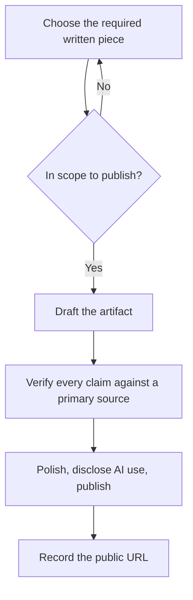

# Capstone C: Public Artifact

**Month:** 12 (Capstone)
**Pattern family:** Synthesis (communication)
**Time budget:** 12 to 16 hours (across several sessions)
**Lab attempt floor:** Not applicable in the engagement sense; there is no target to solve here. The discipline this track enforces instead is the publishing standard: a public artifact is held to the scrutiny of a stranger on the internet who knows more than you, and you do not publish until it meets that bar.
**AI guidance:** Full augmentation, full provenance. AI may help you draft and edit prose, structure a writeup, polish a README, and review your code. AI does not do the underlying work (the lab, the analysis, the tool) for you, and AI assistance is disclosed publicly per `AI-ETHICS.md`. See "AI guidance for this track" below.
**Prerequisites:** The earlier work you intend to publish must already be complete and yours. For a blog post or writeup, the lab or challenge it covers. For a contribution, a project you can navigate. For a tooling repo, your Month 5 and Month 7 tools. `AI-ETHICS.md` re-read, specifically the disclosure section.

**Recall first, from memory, before you read on:** since Month 5 you have disclosed AI use in every notebook entry. What does an honest AI disclosure say, and why does hiding AI use signal the wrong thing to an employer? (Hold the answer. Here the disclosure goes public, in front of strangers, which is exactly where the discipline proves itself.)

## Why this track exists

Capstones A and B prove you can do the work. Capstone C proves you can ship something a stranger will read and judge. The cybersecurity hiring market in 2026 is crowded with people who completed courses. A public artifact is one of the few cheap, durable signals that sets a candidate apart. Think of a blog post a hiring manager can read. A writeup that turns up when they search your handle. A pull request merged into a tool they have heard of. A repository with clean code and honest docs. Any one of these says "this person ships" in a way a private course completion cannot.

It is also the track that builds the muscle of writing for an audience that did not assign the work and owes you no patience. That muscle is what carries your blog, your conference talk, and your internal documentation through the rest of your career.

## The scope and disclosure rules, up front

Two rules govern this track and both come straight from the course scaffolding.

**Scope (`SAFETY.md`).** A public artifact must not disclose anything about a target you were not authorized to test, and must not disclose a vulnerability in a third-party system outside a responsible-disclosure process. A retired-CTF writeup is fine because the platform authorizes write-ups of retired content. A writeup of a live CTF challenge, or of a vulnerability you noticed in a service you use, is not; the latter follows the responsible-disclosure decision tree in `SAFETY.md`, not a blog post. **Do not publish CTF flags**, and do not structure a writeup around the flag; the methodology is the value, the flag is noise, and many platforms forbid flag publication outright. (The tutor never confirms flags either; if you are tempted to ask, re-read the no-flag rule.)

> **If you are outside the US, read this before you publish.** Publishing the artifact, not just running the engagement, is the act this jurisdiction question turns on. Some countries criminalize the distribution of offensive write-ups and tooling itself, separate from any unauthorized access. Before you make an offensive write-up or a tool repository public, confirm your local position per the dual-use-tool-law paragraph in `SAFETY.md` (Germany's StGB 202c, the UK's Computer Misuse Act 3A, and analogous laws elsewhere). The testing being fully authorized does not settle whether you may publish where you live; that is a separate question, and this is the track that triggers it.

**Disclosure (`AI-ETHICS.md`).** Whatever you publish discloses AI assistance, in the form appropriate to the medium. A blog post carries a footer. A repo carries an acknowledgments line. A pull request discloses AI assistance in its description if AI played a non-trivial role. The disclosure is the public-facing Capstone D for this track. It is a demonstration of discipline, not an admission of weakness. An employer who would penalize the honesty is telling you they prefer candidates who hide it.

## Learning objectives

By the end of this track, you can:

- Choose a publishable artifact, confirm it is in scope to publish, and bring it to a standard that survives public scrutiny.
- Write technical material for a stranger who knows more than you do: a clear problem statement, reproducible steps, and an honest account of dead ends.
- Disclose AI assistance publicly in the form appropriate to the medium.
- Defend the artifact's technical claims, in public comments or an interview, from memory.

## Recognition cue

When an interviewer says "show me something you have published" or "do you write or contribute anywhere," this artifact is your answer. Capstone C is where you build the public signal that turns a resume line into a conversation.

## The shape of the track

The flow is short, but the verify step is the one that protects you in public.

*Notice: the scope gate comes before drafting, and the verify step comes before publishing. A public artifact invites public correction, so an unverified claim is a claim you will defend in a comment thread. Verify first. The same flow applies to an optional second artifact if you add one.*

## One public written piece is required; a second artifact is optional

This track has a non-negotiable core and an optional extension. The core fixes a specific hiring red flag: a candidate whose name returns a clean web search. Public code repositories help, but a blog post or a retired-CTF writeup that surfaces when a recruiter searches your handle is a stronger signal, and it is the one this track guarantees.

**Required: one published, searchable, public written piece.** Choose Written Option 1 or Written Option 2 below. This is not optional, and a code contribution or a tooling repository does not satisfy it, because neither produces the searchable written narrative a recruiter's search surfaces. You finish this track with at least one public writeup, period.

> **Common misconception.** "A clean GitHub repo is enough of a public footprint."
> **Reality.** A repo proves you can code; it does not surface as a readable story when a recruiter searches your name, and it does not show you can explain your work to a stranger. A public writeup does both. This is the exact red flag the course claims to solve: do not finish with a clean web search.

### Written Option 1: A blog post walking through an earlier lab

Take one lab from Months 1 through 11 and write it up as a public blog post: the problem, your approach, what you learned, and the dead ends that taught you the most. The best of these are not "how I solved X" but "what X taught me about Y," pitched to a reader one step behind you. Publish it somewhere public (a personal site, a platform like Medium or dev.to, a GitHub Pages blog). Honor the scope rule: a lab you ran on your own systems is yours to write about; a CTF challenge follows the retired-only rule below.

**The defensive default.** Your most likely first role (SOC analyst) is exactly the role whose headline artifact, the IR report, is the one most likely to stay private. So unless your target role is offensive, write the **defensive** piece: a short, sanitized, public-facing version of your Month 9 or Capstone B incident-response or detection work, framed as "what investigating this taught me." No platform answers, no flags, no sensitive data; sanitize the way you would for any public artifact. This gives your defensive work the same public polish as your offensive work, and it doubles as a strong SOC-hiring signal. (If your target role is offensive, an offensive lab writeup is the natural choice, and you give the defensive artifact its public airing through the cross-link stretch goal or a second piece.)

### Written Option 2: A retired-CTF writeup

Write up a CTF challenge you solved, but **only after it has retired** and only where the platform's terms authorize write-ups (HackTheBox retired boxes, picoCTF past events, and similar). The writeup documents the methodology: how you approached it, what you tried, what worked, and the concept it taught. **No flags.** A writeup that leads with the flag is the wrong writeup; a writeup that teaches a stranger the technique is the right one. Confirm the challenge is retired and write-ups are permitted before you publish.

### Optional second artifact: a contribution or a tooling repository

After the required written piece is published, you may add one of these. They are real portfolio signals, but they are an addition to the written piece, never a replacement for it.

- **A contribution to an open-source security tool.** A bug fix, a documentation improvement, a new detection rule, a test. Read the project's `CONTRIBUTING.md` and follow its conventions; a contribution that ignores the project's norms wastes a maintainer's time. It does not have to be large; it has to be real and merged or genuinely under review. Disclose AI assistance in the pull request description if AI played a non-trivial role.
- **A polished tooling repository.** Take the `security-tools/` repository from Month 5 (and the custom work from Month 7) and bring it to a standard you would put on a resume: clean code, real tests, a README a stranger can follow, a `SAFETY.md` for the dual-use tools, and an acknowledgments line disclosing AI's role. "Polished" is the operative word; this is only a capstone artifact if the repository genuinely improves, not if you re-commit Month 5's work unchanged.

## AI guidance for this track

Full augmentation, with the underlying work yours and the disclosure public.

**Allowed.** AI may draft and edit prose, suggest a structure for a writeup, polish a README, review your code for clarity and bugs, and help you tighten the piece for a reader. For the writing-heavy options (1 and 2), AI as a drafting and editing partner is exactly its strength; use it, then make the prose yours.

**Not allowed.** Having AI do the underlying technical work you are writing about (the analysis, the contribution, the tool). Publishing without disclosing AI assistance. Letting AI assert a technical claim in the piece that you cannot defend, because a public artifact invites public correction and your name is on it.

**Logged and disclosed.** AI use is disclosed publicly in the form the medium calls for (the footer, the acknowledgments line, the PR description) and documented in your notebook entry. This is the public Capstone D for this track.

A note on AI and public technical claims: a published artifact will be read by people who know more than you, and some will comment. An AI-asserted claim you did not verify is a claim you will have to defend in public when someone challenges it. Verify every technical assertion in the piece against a primary source before you publish; the embarrassment of a public correction is a strong teacher, and the discipline that prevents it is the one this course built.

## Tasks

### Task 1: Choose the written piece and confirm scope (1 to 2 hours)

Choose your required written piece (Written Option 1 or 2) and confirm it is in scope to publish. If you add an optional second artifact, confirm its scope too. For a CTF writeup: confirm the challenge has retired and write-ups are permitted, and confirm you will publish no flags. For a blog post on a lab: confirm the lab was on your own systems or an authorized platform, and if it is the defensive piece, plan how you will sanitize it (no platform answers, no flags, no sensitive data). For a contribution: confirm the project accepts external contributions and read its `CONTRIBUTING.md`. For a tooling repo: confirm it contains no real credentials or sensitive output.

**Acceptance:** A short note in your engagement records stating the chosen written piece, the artifact, and the specific reason it is in scope to publish (with the relevant policy or terms cited for a CTF writeup or contribution), plus the same for any optional second artifact.

**Checkpoint:** your note names the required written piece, the exact artifact, and a specific in-scope reason with a citation where one is needed.
**If not:** if the scope reason is "it should be fine," that is not a scope check. For a CTF writeup, confirm in writing that the challenge has retired and write-ups are permitted. For a contribution, confirm the project accepts external pull requests. If you cannot state a clean reason, pick a different artifact.

### Task 2: Produce the draft (5 to 6 hours)

Produce the first complete draft of the artifact: the full blog post, the full writeup, the contribution and its accompanying explanation, or the repository's improved state. This is where the underlying work (already done) becomes a public-ready piece.

This track is a project spec, not a step-by-step lab, so there is no finished artifact here to copy. What helps is a model of the *shape* a good writeup section takes. Study this worked example. It is a made-up opening for a fictional writeup, deliberately not your piece, so you copy the structure and not an answer.

> **Weak opening:** "In this post I will get the flag on the Foo box. First I ran nmap."
>
> **Strong opening:** "This box taught me why enumerating every virtual host matters. My first nmap scan showed only a default web page, and I almost moved on. The lesson: a single host can serve several sites, and the interesting one is rarely the default. Here is how I found the second site, and what it cost me to learn that the slow way."

Notice what the strong version does: it leads with what the reader will learn ("why enumerating every virtual host matters"), not with the flag. It is honest about the dead end (almost moving on). It is pitched to a reader one step behind. A writeup built around a flag teaches nothing; a writeup built around a lesson teaches a stranger. Your content is your own; the shape is the model.

**Acceptance:** A complete draft: every section present, every claim made, every step documented. Not yet polished, but complete.

**Checkpoint:** your draft is complete end to end, leads with the lesson rather than the flag, and is honest about at least one dead end.
**If not:** if the draft reads like "how I got the flag," reframe it as "what this taught me about X." If there are no dead ends, you are hiding the most useful part; the wrong turns are what a reader one step behind needs most.

### Task 3: Verify every technical claim (2 to 3 hours)

Go through the draft and verify each technical assertion against a primary source or your own raw evidence. This is the step that protects you from a public correction. For a writeup, confirm each step reproduces. For a tool's README, confirm each documented command works. For a contribution, confirm the change does what you claim and passes the project's tests.

**Acceptance:** A verification pass documented in your notebook: which claims you checked and against what. Any claim you could not verify is removed or corrected, not published on faith.

**Checkpoint:** every technical claim in the draft is checked against a primary source or your own raw evidence, and your notebook records which claim you checked against what.
**If not:** if a claim came from AI and you cannot find a primary source for it, do not publish it; either verify it or cut it. The embarrassment of a public correction is a strong teacher, and this pass is what prevents it.

### Task 4: Polish, disclose, and publish (3 to 4 hours)

Polish the prose or code to the public standard. Add the AI disclosure in the form the medium calls for. Then publish: post the blog, submit the writeup, open the pull request, or make the repository public and clean. Capture the public URL.

**Acceptance:** The artifact is genuinely public, with AI assistance disclosed, and the URL is recorded. For a contribution, the pull request is open and follows the project's conventions (merged is ideal but not required; a serious PR under review counts).

**Checkpoint:** the artifact is live at a public URL, the AI disclosure is present in the form the medium calls for, and no flag appears anywhere in it.
**If not:** if the disclosure is missing, add it now; disclosed AI use is a strength, and a hidden one is the thing employers distrust. If you are about to publish a flag, stop and remove it; the methodology is the value, and many platforms forbid flag publication outright.

### Task 5: Notebook entry (1 hour)

Write `.tutor/notebook/capstone-c.md`: the five-question debrief plus an AI Provenance section, and the public URL of the artifact.

**Acceptance:** A committed notebook entry with the five-question debrief, a complete AI Provenance section, and the public URL. The tutor will not mark Capstone C complete without it.

**Checkpoint:** the entry is committed with the debrief, a substantive AI Provenance section, and the live public URL.
**If not:** if the URL is missing or the artifact is not actually public yet, the track is not done; publish first, then record the URL. A draft on your disk is not a public artifact.

## Definition of Done

You are done with Capstone C when all of these are true:

- At least one public written piece (a blog post or a retired-CTF writeup) is genuinely public at a recorded URL. A contribution or a repository does not satisfy this; the written piece is required.
- It is in scope to publish: no flags, no unauthorized disclosure, retired-only for any CTF content, and sanitized of any sensitive data if it draws on your defensive work.
- AI assistance is disclosed in the form the medium calls for (footer, acknowledgments line, or PR description).
- Every technical claim was verified against a primary source before publishing.
- The notebook entry is committed, and you can pass the verification ritual on any claim in the piece.

**Self-explain:** in one sentence, why does verifying every claim before publishing protect you in a way you cannot get back after the artifact is public?

## Verification

Capstone C is complete when: the artifact is genuinely public, it is in scope to publish (no flags, no unauthorized disclosure, retired-only for CTF content), AI assistance is disclosed in the form the medium calls for, and the notebook entry with the URL is committed.

The tutor confirms the artifact is public and checks the disclosure. Then it runs the verification ritual: it picks one technical claim in the artifact and asks you to defend it from memory, with your AI session closed, exactly as a commenter or interviewer might. If you did the underlying work and verified your claims, this is easy. If AI carried the piece, it is not, and the artifact returns for the understanding it is missing.

## Failure modes and troubleshooting

- **Publishing a flag, or building a CTF writeup around one.** The methodology is the value; the flag is noise and often a terms-of-service violation. Leave it out, and confirm the challenge has retired before you publish.
- **Treating a contribution or a repo as the whole track.** They are an optional addition, not a substitute for the required written piece. Publish the blog post or the retired-CTF writeup first; the searchable writeup is the part that fixes the clean-search red flag.
- **Re-committing Month 5's work unchanged and calling it "polished."** The tooling-repository artifact counts only if the repository genuinely improves. If it does not, it adds nothing.
- **Publishing an unverified AI-asserted claim.** A public artifact invites public correction. The verification pass in Task 3 is what stands between you and an embarrassing comment thread. Do not skip it.
- **Omitting the AI disclosure to look more impressive.** It does the opposite. Disclosed, disciplined AI use is the signal employers screen for; hidden use is the one they distrust. Disclose it.
- **A contribution that ignores the project's conventions.** Read the `CONTRIBUTING.md` first. A PR that fights the maintainer's norms is worse than no PR; it signals you did not do the homework.

## Time budget breakdown

- Task 1 (choose and confirm scope): 1 to 2 hours
- Task 2 (draft): 5 to 6 hours
- Task 3 (verify claims): 2 to 3 hours
- Task 4 (polish, disclose, publish): 3 to 4 hours
- Task 5 (notebook): 1 hour

Total: 12 to 16 hours. Of the three engagement-style tracks (A, B, C) this is the lowest-pressure, and it is a good one to rotate to between sessions on Capstone A and B; the writing rests your offensive and defensive muscles while still moving the capstone forward.

## Stretch goals

Optional, and only after the artifact is published and meets the bar.

1. Write a short follow-up that responds to one piece of public feedback you received, correcting or extending the original. Responding well to correction is its own professional signal.
2. If you wrote a blog post, turn it into a five-minute talk outline. The skill of compressing a written piece into a spoken one carries into interviews and meetups.
3. Cross-link your three capstone artifacts: have the public piece point to the (sanitized, non-flag) skills shown in A and B, so a reader sees a coherent portfolio rather than three isolated items.
4. Publish a second small artifact in a different medium (a blog post if you contributed code, or a tool if you wrote a post). Range across mediums is what makes a portfolio memorable.

## Resources

- Two or three well-regarded security writeups in the style you intend to publish (see `reading.md`), for what makes a piece useful to a stranger.
- The target project's `CONTRIBUTING.md` and issue tracker, if you add the optional open-source contribution.
- `AI-ETHICS.md` ("Disclosure in deliverables"), the standard for the public AI disclosure.
- `SAFETY.md` ("What happens if you find a vulnerability"), the decision tree for anything you might otherwise be tempted to publish that involves a third party.
- `SAFETY.md` ("Dual-use tool laws"), if you are outside the US: the warning that publishing offensive write-ups and distributing offensive tooling can be regulated acts in some jurisdictions, independent of the access rules. Read it before you make any offensive artifact public.
- Your own eleven months of notebooks and artifacts; the raw material for every option is already yours.
