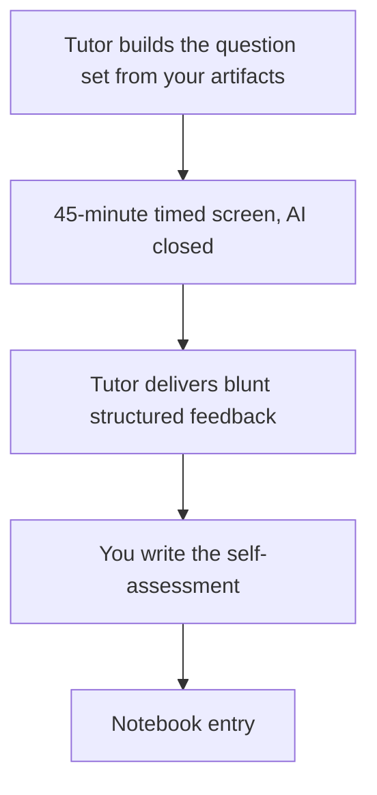

# Capstone E: Timed Mock Technical Screen

**Month:** 12 (Capstone)
**Pattern family:** Synthesis (interview readiness)
**Time budget:** 2 to 3 hours (one timed screen, the self-assessment, and the notebook entry)
**Lab attempt floor:** The screen itself is the floor: 45 minutes, in one sitting, with your AI session closed and your notes closed. You answer from memory, out loud, the way you will in a real screen. You do not pause to look something up; if you do not know it, you say so, the way you would to a real interviewer.
**AI guidance:** AI is closed during the screen. This is the one capstone track where AI assistance is not permitted while you do the work, because the whole point is to rehearse performing without it. You disclose this in the notebook entry, and you may use AI afterward to help you reflect on your self-assessment.
**Prerequisites:** Capstones A, B, and C drafted or complete, and your `RETROSPECTIVE.md` interview problems written (section 4). The screen draws on your own artifacts, so you cannot run it until the artifacts exist.

**Recall first, from memory, before you read on:** `AI-ETHICS.md` says the professional version of the verification ritual is the interview, and that the candidates who built the verification habit are the ones who answer cleanly while the ones who skipped it do not get through. You have defended single findings under the verification ritual all year. What is different about defending your whole portfolio in one 45-minute sitting, switching topics under time pressure, with a stranger pushing back? (Hold the answer. That gap is exactly what this track closes.)

## Why this track exists

Capstones A, B, and C build the artifacts. The verification ritual, all year, has rehearsed defending **one** finding, paragraph, or query at a time. What no part of the course has rehearsed is the **whole screen**: 45 minutes, several topics, a stranger asking the next question before you have finished settling the last, and the recovery from an answer you got wrong. A candidate who can defend any single finding can still fall apart in the gestalt of a live screen, because the screen tests something the per-finding ritual does not: pacing, topic-switching, and composure under time.

This is the most common way strong candidates fail. The work is sound, the artifacts are real, and the candidate freezes the moment the screen is the whole conversation rather than one artifact at a time. This track is the rehearsal that fixes it. You run one timed mock technical screen against your own portfolio, you take blunt structured feedback, and you write down what you learned about your own delivery.

It is not a track that produces a portfolio artifact. It produces a rehearsed candidate. That is its own deliverable, and the course is not finished without it.

## How the no-answers rule applies here

This track stays inside the course's no-answers design, and it is worth being explicit about how, because a mock interview could be run the wrong way.

**The tutor asks and critiques. The tutor never models the answer.** The tutor draws questions from your own artifacts and your own `RETROSPECTIVE.md` interview problems, times you, and then tells you what landed, what rambled, and what you left undefended. It does not tell you what you should have said. It does not feed you a model answer to memorize. If it did, you would be reciting the tutor's words in the real screen, which is the exact failure the course is built to prevent.

The answers are yours, from memory, with AI closed. The feedback is on your **delivery**: was the answer structured, did it stay on time, did you defend the claim with evidence, did you recover when you were wrong, or did you ramble, freeze, or bluff. That is the same stance the tutor takes everywhere else in the course, applied now to a whole screen instead of a single finding.

## Learning objectives

By the end of this track, you can:

- Sit a timed, 45-minute technical screen against your own portfolio and answer from memory with AI closed.
- Switch between offense, defense, fundamentals, and AI-workflow topics under time pressure without losing structure.
- Recover from an answer you got wrong or do not know, the way a real candidate must, rather than freezing or bluffing.
- Assess your own interview delivery honestly in writing, and name the two or three things you will drill before a real screen.

## Recognition cue

This is the rehearsal for the moment an interviewer says "we have 45 minutes; let us start with your pentest report and then move around." Every other capstone track builds an artifact you will be asked about. This track rehearses being asked about all of them at once.

## The shape of the screen

The flow is short and the timing is the point. The screen runs once, end to end, before any feedback.

*Notice: the screen runs to the end before any feedback. A real screen does not pause to coach you mid-answer, and neither does this one. The feedback and the self-assessment come after, when the whole performance is on the table.*

## The screen format

One screen, **45 minutes**, run in a single sitting. The tutor conducts it. The structure:

- **5 technical questions**, drawn across offense, defense, fundamentals, and the AI workflow, anchored to **your own artifacts**. For example: a question about a finding in your Capstone A report, a question about a timeline entry or detection in your Capstone B report, a fundamentals question from an earlier month, and a question about where AI was wrong in your work and how you caught it (the question your Capstone D appendices are built to answer).
- **5 behavioral questions**, drawn from the kind a real entry-level screen asks: a time you were stuck and got unstuck, how you use AI responsibly in security work, a project you are proud of, the role you are targeting and why you fit it (this is where your Capstone F positioning statement gets its first live test), and where you want to be in two years.

The tutor times the whole thing, pushes back on at least one answer the way a real interviewer would, and may ask a follow-up that goes one level deeper than you expected. You answer from memory, out loud or in writing in real time, with AI closed and your notes closed. If you do not know something, you say so and reason about how you would find out, rather than bluffing. That recovery is itself part of what the screen rehearses.

> **Common misconception.** "I will prep model answers for each likely question and recite them."
> **Reality.** A recited answer collapses the moment the interviewer asks the follow-up you did not script, and a screen always asks one. The skill this track builds is answering from understanding under time pressure, not retrieving a memorized script. The tutor will probe exactly where a script runs out.

### Strongly recommended: a second screen run by a human

The tutor-run screen is the required floor, and it is built to be available to every learner, including the one working alone. But the tutor is an interlocutor you have worked with for a year, and that familiarity blunts the one thing a real screen does that rattles candidates most: a stranger improvising pushback, asking the unscripted follow-up, and reading your hesitation in real time. So **if you can reach a human to run a second screen (a study partner, a mentor, a peer from a community), do it.** It is not required, because not every solo learner can reach one, but where a person is reachable it is the single highest-value rehearsal in this track and the closest thing to the real screen.

The how-to is light. Hand your reviewer this track's screen format (5 technical, 5 behavioral, anchored to your artifacts) and your `RETROSPECTIVE.md` interview problems. Ask them to time you to 45 minutes, to push back on at least one answer, and to ask one follow-up that goes a level deeper than you expected, exactly as the tutor does. They do not need to know your material; the questions come from your artifacts, and their job is to apply time pressure and unscripted pushback, then tell you where you rambled, froze, or bluffed. Run it after the tutor screen, so the tutor pass has already surfaced your weak answers and the human pass tests them under a stranger's eye. Record it in your notebook the same way, noting that AI was closed for it too.

## AI guidance for this track

AI is closed during the screen, and that is the whole point.

**During the screen.** No AI. No notes. No looking anything up. This is the one place in the capstone where the work is explicitly done without augmentation, because the skill is performing without it, the way the real screen demands.

**After the screen.** Once the screen is over and you have written your own self-assessment, AI may help you reflect: summarize the feedback into a drill list, or help you think through a weak answer you want to strengthen. It does not write the self-assessment for you, and it does not retroactively supply the answers you missed.

**Logged.** The notebook entry records that the screen was run with AI closed, and any AI use in the reflection afterward, in the usual provenance format. "Screen run with AI and notes closed; after the screen, used AI to group the tutor's feedback into a three-item drill list" is the kind of entry this track produces.

## Tasks

Do these in order. The screen (Task 2) comes after you have the artifacts to be screened on (Task 1), and the self-assessment (Task 3) comes only after the screen is fully done.

### Task 1: Assemble the question surface (30 minutes)

You do not write the questions; the tutor does. Your job is to make sure the surface they are drawn from exists. Confirm that Capstones A, B, and C are drafted or done, and that your `RETROSPECTIVE.md` interview problems (section 4) are written. Tell the tutor which artifacts are ready and which role you are targeting (from Capstone F), so it can weight the screen toward the work that matters for that role.

**Acceptance:** The tutor confirms it has enough of your own material (artifacts plus RETROSPECTIVE interview problems) to build a 45-minute screen anchored to your work.

**Checkpoint:** the tutor confirms your artifacts and RETROSPECTIVE section 4 are ready, and knows your target role.
**If not:** if the artifacts are not drafted yet, this track is blocked; finish enough of A, B, and C that there is real work to be screened on. A mock screen against artifacts that do not exist yet is theatre, not rehearsal.

### Task 2: Sit the timed screen (45 minutes, in one sitting)

Run the screen. 45 minutes, one sitting, AI closed, notes closed. The tutor asks the ten questions, times you, and pushes back. You answer from memory. You do not pause the clock to look something up. When you do not know, you say so and reason out loud about how you would find out.

**Acceptance:** A completed 45-minute screen: all ten questions attempted, timed, with AI and notes closed for the duration.

**Checkpoint:** you sat the full screen in one timed sitting with AI and notes closed.
**If not:** if you paused to look things up, or opened your notes, or stopped early, the rehearsal did not happen; the value is entirely in performing under the real constraint. Reset and run it again, honestly, end to end.

### Task 3: Take feedback and write the self-assessment (45 minutes to 1 hour)

After the screen, the tutor delivers blunt structured feedback: which answers landed, which rambled, which were undefended, where you bluffed instead of admitting you did not know, and how your pacing held up across the 45 minutes. The tutor does not tell you the answers; it tells you about your delivery. Then you write the self-assessment yourself.

The self-assessment names, in writing: the two or three answers you were weakest on and why, the one topic where you ran out of substance fastest, how your composure held under the time pressure and the pushback, and the specific drills you will run before a real screen. This is yours to write, the same way the `RETROSPECTIVE.md` weak-patterns section is yours.

**Acceptance:** A written self-assessment (roughly 400 to 800 words) naming your weakest answers, your pacing under pressure, and a concrete drill list. It is honest about where you struggled; a self-assessment that says the screen went fine is worthless.

**Checkpoint:** your self-assessment names specific weak answers, addresses your pacing and composure, and lists concrete drills, in your own words.
**If not:** if the self-assessment flatters you, it teaches you nothing. Name the answer you fumbled and why. The point of a mock screen is to fail safely here, where it costs you nothing, so that you do not fail in the real one.

### Task 4: Notebook entry (30 minutes)

Write `.tutor/notebook/capstone-e.md`: the five-question debrief plus an AI Provenance section. Treat the debrief seriously here: the fifth question (what you would do differently next time) is the heart of this track, because the next time is a real screen.

**Acceptance:** A committed notebook entry with the five-question debrief and an AI Provenance section recording that the screen was run with AI closed and any AI use in the reflection afterward. The tutor will not mark Capstone E complete without it.

**Checkpoint:** the entry is committed with the five-question debrief and a provenance section noting AI was closed during the screen.
**If not:** if the provenance section does not state that the screen itself was run with AI closed, add that; for this track, the AI-closed constraint is the point, and the appendix is where you record that you honored it.

## Definition of Done

You are done with Capstone E when all of these are true:

- You sat a full 45-minute timed screen in one sitting, with AI and notes closed.
- The questions were drawn from your own artifacts and RETROSPECTIVE interview problems, not a generic bank.
- You took the tutor's structured feedback and wrote your own honest self-assessment naming weak answers, pacing, and a drill list.
- The notebook entry is committed and records that the screen was run with AI closed.
- Strongly recommended, not required: if a human (a study partner, a mentor, a peer) was reachable, you ran a second screen with them and folded their pushback into your self-assessment. The tutor screen is the floor; the human screen is the closest rehearsal to the real thing, and you do it whenever you can reach someone to run it.

**Self-explain:** in one sentence, why does rehearsing the whole screen under time prepare you for something that defending one finding at a time never could?

## Verification

Capstone E is complete when: the timed screen was sat in one sitting with AI closed, the questions were anchored to your own work, the self-assessment is written and honest, and the notebook entry is committed.

The tutor does not re-run a verification ritual on this track in the usual way, because the screen **is** the verification ritual, scaled to the whole portfolio. What the tutor checks is that you actually sat it under the real constraint and that your self-assessment is honest rather than flattering. If you treated the screen as a rehearsal and learned from where it hurt, this track did its job. If you looked things up or wrote a self-assessment that says everything went fine, it did not, and you run it again.

## Failure modes and troubleshooting

- **Reciting prepared answers instead of answering from understanding.** A scripted answer breaks on the first follow-up, and a screen always asks one. Answer from what you actually know; let the tutor probe where a script would run out.
- **Pausing the clock to look something up.** The real screen has no pause button. If you stop to check a fact, you have not rehearsed the thing that matters. Run it under the real constraint or it is not rehearsal.
- **Bluffing when you do not know.** Interviewers see through it instantly, and it costs you more than an honest "I do not know, here is how I would find out." Practice the honest recovery here, where it is safe.
- **A self-assessment that flatters you.** "It went well" teaches you nothing. Name the answers you fumbled, the topic you ran dry on, and the moment your composure slipped. That is the material you drill before the real screen.
- **Running the screen before the artifacts exist.** A mock screen with nothing real to be asked about is theatre. Draft A, B, and C first; the screen is anchored to your own work.

## Time budget breakdown

- Task 1 (assemble the question surface): 30 minutes
- Task 2 (sit the timed screen): 45 minutes
- Task 3 (feedback and self-assessment): 45 minutes to 1 hour
- Task 4 (notebook): 30 minutes

Total: 2 to 3 hours. This is the shortest capstone track, and it is best run late, after A, B, and C are drafted and your RETROSPECTIVE interview problems are written, so the screen has real material to draw on.

## Stretch goals

Optional, and only after the first screen and self-assessment are done.

1. Run a second screen a week later, after drilling the weak answers from the first, and compare the two self-assessments. The improvement between them is the most honest measure of whether the drilling worked.
2. If you could not reach a human for the strongly-recommended second screen earlier, keep trying; once you find a partner or mentor, run that human-led screen (see "Strongly recommended: a second screen run by a human" above) and compare it to the tutor screen. It stretches you in a way the tutor cannot, and it is the closest rehearsal to the real thing.
3. Record yourself answering one technical and one behavioral question, then watch it back. Seeing your own filler words, pacing, and composure is uncomfortable and unusually instructive.

## Resources

- Your own Capstone A, B, and C artifacts, and your `RETROSPECTIVE.md` interview problems (section 4). These are the entire question surface; the screen is anchored to your work, not a generic question bank.
- Your Capstone F positioning statement and target role, so the screen weights toward the work that matters for the role you are pursuing.
- `AI-ETHICS.md` ("the professional version of the verification ritual is the interview"), the reason this rehearsal exists and the reason AI is closed for it.
