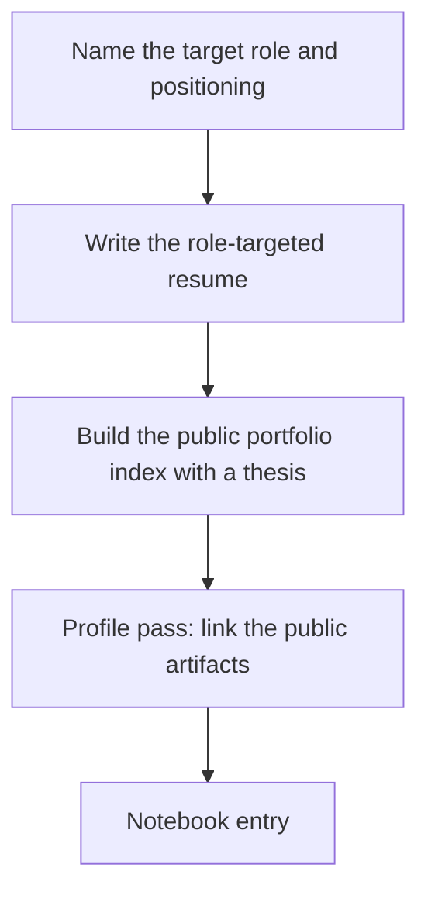

# Capstone F: Portfolio Package and Target Role

**Month:** 12 (Capstone)
**Pattern family:** Synthesis (positioning and presentation)
**Time budget:** 4 to 6 hours (across a few sessions)
**Lab attempt floor:** Not applicable in the engagement sense; there is no target to solve. The discipline this track enforces is honesty: every claim on the resume and the index must trace to an artifact you can defend, the same bar the verification ritual sets for everything else.
**AI guidance:** Full augmentation, full provenance. AI may help you draft and tighten resume bullets, structure the index page, and polish the positioning statement. AI does not invent experience you do not have, and the resume discloses AI use the way every deliverable does. See "AI guidance for this track" below.
**Prerequisites:** Capstones A, B, and C drafted or complete, so you have artifacts to package. `RETROSPECTIVE.md` strong-patterns section (section 2) drafted, because the resume bullets are mined from it. `AI-ETHICS.md` re-read, specifically the disclosure section.

**Recall first, from memory, before you read on:** for eleven months the course has said, in nearly every deliverable, "a hiring manager will read this." You now have a stack of artifacts built to that standard. Here is the uncomfortable question: a recruiter spends well under a minute on a first pass and does not browse a repo tree to reconstruct your story. If your work is scattered across eight repos and notebooks with no front door, who does the work of assembling it into a portfolio? (Hold the answer. This track makes sure the answer is you, before the engagement, and not the busiest person in the hiring process.)

## Why this track exists

Capstones A, B, C, and E build the work and rehearse defending it. None of them gets the work **looked at**. In a 2026 entry-level screen, a clean GitHub is necessary but not sufficient. The resume and the profile are what earn the first call, and a single coherent landing page is what makes a hiring manager want to read the rest. A graduate who finishes Vigil with a strong body of work but no packaged, role-targeted way to present it has built the hardest part and skipped the cheap part that gets it read.

This track closes that last mile. You name a target role, you write a one-to-two-page role-targeted resume, you build a single public portfolio index that presents the body of work as one coherent story with a thesis, and you do a profile pass (LinkedIn or equivalent) so the public artifacts surface when a recruiter looks. The work already exists. This track packages it for the person who decides.

It is the lowest-pressure track in the capstone, and the highest-leverage one for actually getting hired. The breadth you built over the year (offense, defense, cloud, AI) only becomes a defensible market position once you can say "here is the role I am targeting, and here are the artifacts that prove I fit it." That articulation is the whole job of this track.

## The scope and honesty rules, up front

Two rules govern this track.

**Honesty (the verification ritual, applied to the resume).** Every claim on your resume and your index must trace to an artifact you can defend from memory with AI closed. A resume is the document an interviewer reads before they decide what to ask you, so a bullet you cannot back up is a bullet that sinks the screen. You do not list a skill you cannot demonstrate, and you do not inflate a lab into "production experience." The course spent a year making your claims defensible; do not undo that on the resume.

**Disclosure (`AI-ETHICS.md`).** AI may help you draft and tighten the resume and the index, and that assistance is disclosed the way every deliverable in the course discloses it. The disclosure for this track lives in the notebook entry and, where the medium calls for it, on the artifact: an acknowledgments line in the portfolio-index repository, the same way Capstone C's tooling repo carries one. The resume itself does not need a footer, but the work that produced it is logged in your notebook provenance like everything else.

## Learning objectives

By the end of this track, you can:

- Name the one or two roles you are targeting and state, in two sentences, why you fit them.
- Write a one-to-two-page role-targeted resume whose every claim traces to a defensible artifact.
- Build a single public portfolio index that presents your body of work as one coherent story with a thesis, ordered to lead with the artifacts relevant to your target role.
- Present a public profile (LinkedIn or equivalent) that links your public artifacts so they surface when a recruiter searches your name.

## Recognition cue

This is the work behind the moment a recruiter has your resume open in one tab and your portfolio index in another, deciding in under a minute whether to book the call. Every other track builds something you get asked about; this track builds the thing that decides whether you get asked at all.

## The shape of the track

The target role comes first, because everything downstream is ordered around it.

*Notice: the target role is the keystone. The resume leads with the artifacts that prove fit for it, the index orders the body of work around it, and the profile surfaces it. Name the role first, and the rest has a spine.*

## The target role comes first

Before you write a word of the resume or the index, name your target. This is the keystone for the whole track, and it is the answer to the interview question "what role are you targeting and why you for it" that you will face live in Capstone E.

Write down, in your `RETROSPECTIVE.md` (this is the target-role commitment that section now requires) or in your engagement records:

1. **The one or two roles you are targeting.** Be specific and realistic: "SOC analyst, with detection engineering as the growth path," or "junior AppSec, leaning on the Month 7 and Month 11 work," not "a cybersecurity job."
2. **Which of your artifacts lead for each role.** Name the two or three that prove fit. A SOC target leads with the Capstone B IR report and the Month 9 detection work; an offensive target leads with the Capstone A pentest report.
3. **The two-sentence positioning statement** you would open a screen with: who you are, what you are targeting, and the evidence that backs it. This is the statement Capstone E puts to a live test.

> **Common misconception.** "Naming one target role narrows my options and costs me other jobs."
> **Reality.** The opposite. A candidate who targets everything reads as undifferentiated and proves nothing. A candidate who says "here is the role, and here are the three artifacts that prove I fit it" is the one a hiring manager remembers. You can apply to adjacent roles with the same artifacts reordered; what you cannot do is present a pile of coursework and hope the reader assembles a story from it.

## AI guidance for this track

Full augmentation, with the claims yours and defensible.

**Allowed.** AI may draft resume bullets from your strong-patterns section, tighten them to the conventions of a technical resume, suggest a structure for the index page, polish the thesis statement, and review your profile copy for clarity. For the writing here, AI as a drafting and editing partner is exactly its strength.

**Not allowed.** Having AI invent experience, inflate a lab into "production work," or assert a skill you cannot demonstrate. Publishing a profile or index claim you cannot defend, because the resume is the document that sets up the screen, and every line is a line you may be asked to back up. Letting AI choose your target role for you; the positioning is yours, drawn from your own honest read of your strong patterns.

**Logged and disclosed.** AI use is logged in your notebook entry and disclosed on the artifact where the medium calls for it (an acknowledgments line in the index repository). This is the public-facing disclosure for this track, in the same discipline as Capstone C.

A note on AI and resume claims: AI will happily phrase a thin lab as an impressive-sounding accomplishment, and an inflated bullet is the fastest way to lose a screen, because the interviewer probes exactly the impressive-sounding claim. Keep every bullet to what you can defend. The honest version of a strong year is more convincing than an inflated version of it.

## Tasks

Do these in order. The target role (Task 1) comes first because the resume and index are built around it.

### Task 1: Name the target role and write the positioning statement (1 hour)

Name your one or two target roles, the artifacts that lead for each, and the two-sentence positioning statement, as described in "The target role comes first" above. Commit this to your `RETROSPECTIVE.md` as the target-role commitment, so the retrospective, the resume, the index, and the Capstone E screen all hang on the same spine.

**Acceptance:** A committed target-role statement: the one or two roles, the lead artifacts for each, and a two-sentence positioning statement, in your `RETROSPECTIVE.md` or engagement records.

**Checkpoint:** you have named a specific target role, the artifacts that lead for it, and a two-sentence positioning statement you could say out loud in a screen.
**If not:** if the target is "any security role," you have not committed; pick the one or two that your strongest artifacts actually support. If you cannot name which artifacts lead, re-read your `RETROSPECTIVE.md` strong-patterns section; the lead artifacts are the ones you would welcome a hard question about.

### Task 2: Write the role-targeted resume (1 to 2 hours)

Write a one-to-two-page resume targeted at the role from Task 1. Mine the bullets from your `RETROSPECTIVE.md` strong-patterns section: each strong pattern, tied to the artifact that proves it, becomes a resume claim a hiring manager cares about. Order the content to lead with what matters for your target role. Every bullet traces to an artifact you can defend.

This track is a project spec, not a step-by-step lab, so there is no finished resume here to copy. What helps is a model of the *shape* a strong bullet takes versus a weak one. Study this worked example. It describes a fictional candidate, deliberately not you, so you copy the structure and not the content.

> **Weak bullet:** "Experienced in penetration testing and incident response."
>
> **Strong bullet:** "Scoped and executed a full penetration test against an authorized target, then wrote a 20-page client-grade report with CVSS-scored findings and remediation (link). Investigated a multi-stage breach in a self-built SIEM and produced a NIST 800-61 incident report with a defensible timeline and IOCs (link)."

Notice what the strong version does: it names the concrete artifact, ties the claim to evidence a reader can open, uses the language of the field (CVSS, NIST 800-61, IOCs), and makes a claim the candidate can defend in the screen. The weak version asserts a skill with nothing behind it, which is the kind of bullet an interviewer probes and the candidate cannot back up. Your content is your own; the shape is the model.

**Write for the keyword screen, without inflating a word.** At many companies, especially the 300-to-3000-employee mid-tier this course targets, your resume is filtered by an **applicant tracking system** (an ATS, the software that scans resumes for keyword matches) before a human ever reads it. A portfolio-heavy, certification-light candidate, which is exactly what this course produces by design, is the profile most likely to be auto-rejected for missing the literal terms a job description lists. So mirror the language of the job descriptions you are targeting: use the exact tool and framework names you can honestly claim from your artifacts (your SIEM by name, MITRE ATT&CK, NIST 800-61, CVSS, OWASP, the specific tools you used), spelled the way the posting spells them. This is the honesty rule, not a loophole in it: every keyword must still trace to a real artifact you can defend. You are using the field's vocabulary you spent a year earning, not padding the resume with skills you cannot back up. A resume that says "wrote detection rules" when the posting screens for "Sigma" and "SIEM" can be filtered out before the work is ever seen; name the tools, and let the qualification reach a human.

**Acceptance:** A one-to-two-page resume targeted at your stated role, every claim traceable to an artifact, ordered to lead with the role-relevant work. No em dashes, to match the course house style.

**Checkpoint:** your resume is one to two pages, leads with the artifacts relevant to your target role, and every claim points to work you can defend.
**If not:** if a bullet asserts a skill with no artifact behind it, cut it or tie it to the evidence; a claim you cannot defend is a claim that sinks the screen. If the resume reads the same for every role, it is not targeted; reorder it to lead with what your target role cares about most.

### Task 3: Build the public portfolio index (1 to 2 hours)

Build a single public landing page that presents your body of work as one coherent portfolio with a thesis. This is the front door a hiring manager hits first. It can be a public repository README or a simple GitHub Pages page. It opens with a thesis (a one-line statement of who you are and what you are targeting, the same positioning from Task 1), then lists your artifacts, one line each on the skill it proves, ordered to lead with the artifacts relevant to your target role and link out to the rest.

Use the course's own framing of your body of work (the public artifacts from Months 2, 5, 7, and 10, the capstone reports, and your Capstone C public piece) rather than padding the list. The index links to what is genuinely public; private notebooks stay private and are not linked.

**Acceptance:** A single public page (README or GitHub Pages) with a one-line thesis, your public artifacts listed one line each on the skill each proves, ordered to lead with your target-role work, linking out to the rest. Genuinely public, at a recorded URL.

**Checkpoint:** the index is live at a public URL, opens with a thesis tied to your target role, and orders the artifacts to lead with the role-relevant ones.
**If not:** if the page is just a list of repo links with no thesis, it reads as a pile of coursework; add the one-line statement of who you are and what you are targeting at the top. If the order is random, reorder it so the artifacts that prove fit for your target role come first; a hiring manager reads the top of the page and little else.

### Task 4: Profile pass (1 hour)

Do a pass on your public profile (LinkedIn or an equivalent professional profile) so the body of work surfaces when a recruiter searches your name. Link your public artifacts: the portfolio index, the public repositories, and your Capstone C public piece. Present the work as a story, using the same positioning statement and thesis, not as a bare list of repository names. The point is that a search for your handle returns the coherent portfolio you just built, not a blank or a scatter of disconnected links.

**Acceptance:** A public profile that links your portfolio index and public artifacts, framed with your positioning statement, so a recruiter searching your name finds the body of work presented as a story.

**Checkpoint:** your public profile links the portfolio index and the public artifacts, and presents them with your positioning rather than as a bare link list.
**If not:** if the profile is a list of links with no narrative, add the positioning statement so a reader understands the story before they click. If the public artifacts are not linked at all, the profile does the opposite of its job; link them so a name search surfaces your work.

### Task 5: Notebook entry (30 minutes)

Write `.tutor/notebook/capstone-f.md`: the five-question debrief plus an AI Provenance section, and the public URL of the portfolio index.

**Acceptance:** A committed notebook entry with the five-question debrief, an AI Provenance section, and the public URL of the index. The tutor will not mark Capstone F complete without it.

**Checkpoint:** the entry is committed with the debrief, an AI Provenance section, and the live URL of the index.
**If not:** if the URL is missing or the index is not actually public yet, the track is not done; publish the index first, then record the URL. A draft on your disk is not a front door.

## Definition of Done

You are done with Capstone F when all of these are true:

- A target role is named, with lead artifacts and a two-sentence positioning statement, committed to `RETROSPECTIVE.md`.
- A one-to-two-page role-targeted resume exists, every claim traceable to a defensible artifact.
- A single public portfolio index is live at a recorded URL, opening with a thesis and ordered to lead with the target-role artifacts.
- A public profile links the index and the public artifacts, framed with the positioning statement.
- The notebook entry is committed, and you can defend every claim on the resume and the index from memory.

**Self-explain:** in one sentence, why does naming a target role *before* writing the resume and the index produce a stronger package than writing them first and choosing a role after?

## Verification

Capstone F is complete when: a target role and positioning statement are committed, the resume is written with every claim traceable to an artifact, the portfolio index is public with a thesis and role-led ordering, the profile links the public work, and the notebook entry is committed.

The tutor checks that the index is genuinely public and that the resume and index lead with the target-role artifacts rather than reading as an undifferentiated pile. Then it runs the verification ritual: it picks one claim on your resume or index and asks you to point to the artifact behind it and defend it from memory, with AI closed. A resume is the document that sets up the screen, so a claim you cannot defend is the one that sinks it. If every claim traces to work you did, this is easy. If a bullet is inflated, it is not, and that bullet returns until it is honest.

## Failure modes and troubleshooting

- **Targeting every role at once.** A resume and index that read the same for every job prove nothing and read as undifferentiated. Name the one or two roles your strongest artifacts support, and order everything around them.
- **A resume bullet you cannot defend.** The interviewer probes exactly the impressive-sounding claim. Every bullet traces to an artifact you can defend from memory, or it is cut.
- **An index that is a bare list of repo links.** With no thesis and no ordering, it reads as a pile of coursework. Open with the one-line positioning statement and lead with the role-relevant work.
- **Inflating a lab into "production experience."** It is the fastest way to lose a screen, because the gap shows the moment the interviewer asks one follow-up. The honest version of a strong year is more convincing than an inflated version of it.
- **A profile that does not link the public work.** If a recruiter searches your name and finds nothing, the year of public artifacts does you no good. Link the index and the public repositories, framed with your positioning.

## Time budget breakdown

- Task 1 (target role and positioning): 1 hour
- Task 2 (resume): 1 to 2 hours
- Task 3 (portfolio index): 1 to 2 hours
- Task 4 (profile pass): 1 hour
- Task 5 (notebook): 30 minutes

Total: 4 to 6 hours. This is a low-pressure track and a good one to rotate to between sessions on A and B; packaging the work is a different muscle from doing it, and the change of pace helps.

## Stretch goals

Optional, and only after the resume, index, and profile meet the bar.

1. Write a second one-page resume for your secondary target role, reordered to lead with different artifacts, so you can see how the same body of work re-frames for a different door.
2. Ask a peer or mentor to read your index cold for one minute and tell you what they think you are targeting. If their answer does not match your intended role, your thesis and ordering are not doing their job.
3. Add a one-line "what I am learning next" note to the index, drawn from your `RETROSPECTIVE.md` maintenance plan, so the portfolio reads as a trajectory and not a finished pile.

## Resources

- Your `RETROSPECTIVE.md` strong-patterns section (section 2) and target-role commitment, the source of every resume bullet and the spine of the package.
- Your public artifacts (Months 2, 5, 7, 10, the capstone reports, and your Capstone C public piece), the body of work the index presents.
- `AI-ETHICS.md` ("Disclosure in deliverables"), the standard for disclosing the AI assistance that helped you draft the resume and index.
- Two or three strong technical resumes and portfolio pages in your target area, for structure and tone, never to copy; your claims are your own.
