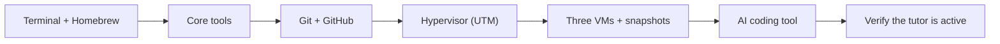
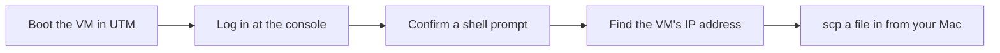

# Getting Started

This page takes you from a stock Mac to a working Vigil setup. You will install the host tools, build the home lab, set up version control, and turn on the AI coding tool that runs the tutor. Work through it in order. When you finish, you are ready for Month 0, which turns this setup into a documented deliverable.

Read `SAFETY.md` and `AI-ETHICS.md` before you build your first VM. They are short. They define the line that keeps this work legal.

Here is the order you will follow:


*Notice: each step depends on the one before it. Do them in order, and do not skip the snapshot step.*

## What you need

- A Mac. Apple Silicon (M1 or later) is assumed. Intel Macs work for most of the course; the few differences are flagged inline.
- At least 16 GB of memory and 100 GB of free disk. The home lab runs two or three VMs at a time. 8 GB is painful; 16 GB is fine; 32 GB is roomy.
- A steady internet connection. Some labs download large VM images.
- About 10 to 15 hours per week. See "The time commitment" below.

If you are on Windows or Linux, the ideas still apply, but the commands and the VM tools differ. You will have to translate the host steps yourself. The worked examples assume macOS.

## Step 1: The terminal and Homebrew

You will live in a terminal for twelve months. Set it up with care.

1. Open the built-in **Terminal** app (press `Cmd-Space`, type `Terminal`, press Enter). You can switch to iTerm2 or Ghostty later. The stock terminal is fine to start.

2. Install **Homebrew**, the tool that installs other tools on a Mac:

   ```zsh
   /bin/bash -c "$(curl -fsSL https://raw.githubusercontent.com/Homebrew/install/HEAD/install.sh)"
   ```

   Read what it prints. On Apple Silicon it asks you to add one line to your shell so the `brew` command is found. Do that, then close and reopen the terminal.

3. Check that it worked:

   ```zsh
   brew --version
   ```

   A version number means success. "command not found" means the path step did not take; re-read Homebrew's last message.

## Step 2: Core command-line tools

Install the tools the early months use:

```zsh
brew install git gh wget nmap wireshark python3
```

- `git` tracks your work. `gh` is the GitHub command-line tool.
- `wget` downloads files from the terminal.
- `nmap` and `wireshark` show up in Months 3 and 4. Installing them now means one less thing to debug later.
- `python3` is the **Python** interpreter. Month 1's first lab uses it to check a file, and Month 5 is built on it. Confirm it is present:

  ```zsh
  python3 --version
  ```

  You should see `Python 3.x` (any 3 is fine). If you instead get "command not found" or a prompt to install developer tools, run `xcode-select --install`, let it finish, and try again.

You do not need to understand these tools yet. Month 1 will not let you run them until you can say what they do. Installing is not running.

### A text editor (you will create files from Lab 1.1)

From the very first lab you will create and edit text files: notes ending in `.md` and scripts ending in `.sh`. You need one editor and the muscle memory to save a file in it. Two good choices:

- **`nano`** is a small editor that is already on your Mac. Nothing to install. To create or open a file, type `nano notes.md` at the terminal. Type your text. Save with `Ctrl-O` then Enter, and quit with `Ctrl-X`. The shortcuts are listed along the bottom of the screen, where `^` means the Control key. This is enough for the whole course.
- **VS Code** is a full graphical editor, if you would rather click than memorize keys. Install it from code.visualstudio.com, open it, and use File then New to make a file. When you save, type the full name including the extension (`inventory.sh`, not just `inventory`).

Try it now so it is not new when a lab depends on it. Create a file, type one line, save it, and read it back:

```zsh
nano hello.md
# type a line, then Ctrl-O, Enter, Ctrl-X
cat hello.md
```

A `.sh` file is made the same way: `nano demo.sh`, type the lines, save, quit. The `.sh` ending is just a name; it tells you and other tools that the file holds shell commands. You run it later with `bash demo.sh`.

## Step 3: Git and GitHub

Your work lives in Git from day one. Your portfolio is a set of public repositories.

1. Make a free GitHub account if you do not have one. Pick a professional username; this account is part of your portfolio.

2. Log in the command-line tool:

   ```zsh
   gh auth login
   ```

   Choose GitHub.com, HTTPS, and log in through the browser when asked.

3. Set your Git name and email:

   ```zsh
   git config --global user.name "Your Name"
   git config --global user.email "you@example.com"
   ```

4. Make a repository for your own work. This is separate from the Vigil course repo you are reading:

   ```zsh
   gh repo create my-vigil-work --private --clone
   ```

   Keep it private for now. The course tells you when to make a piece public, and you decide when it is ready. The first public piece is the Month 1 boot writeup.

### Where your work lives (read this once, then never wonder again)

You now have two repositories on your Mac, and they have two different jobs. Getting this straight now saves confusion in every later lab.

- **The Vigil course repo** (the one you clone in Step 6) holds the curriculum and the tutor. You **never modify the shipped course files**: the lab READMEs, the month pages, the rule files. There is exactly one place you write inside this repo: your **notebook entries**, which live under `.tutor/notebook/` (for example `.tutor/notebook/lab-01-hardware-inventory.md`). Adding your own notebook entries there is expected; editing the course's own files is not.
- **Your `my-vigil-work` repo** holds everything else you produce: your **deliverables** (the things each month asks you to hand in), your **scripts and write-ups**, and your **lab scratch artifacts** (the files you create while working a lab, such as `inventory-manual.md` or `inventory.sh`). This repo is yours. Make it as messy as you need.

The short rule: **notebook entries go in the course repo under `.tutor/notebook/`; everything else you make goes in `my-vigil-work`.** A lab that tells you to create a file "in this lab's folder" means a folder inside your own `my-vigil-work` work tree, not inside the shipped course repo. When in doubt, if it is a notebook entry it belongs in the course repo, and if it is anything else it belongs in `my-vigil-work`.

## Step 4: The home lab (virtual machines)

Most labs run inside virtual machines, not on your real Mac. A **virtual machine** (VM) is a complete computer that runs as software on top of your Mac. Using VMs keeps the practice away from your real files and gives you snapshots to roll back to when a lab breaks something.

### The hypervisor

A **hypervisor** is the software that runs VMs. On Apple Silicon, use **UTM**. It is free and built for Apple chips:

```zsh
brew install --cask utm
```

Other options: **VMware Fusion** (free for personal use, good on Apple Silicon) and **VirtualBox** (free; Apple Silicon support is still rough as of 2026, so prefer UTM or Fusion on M-series Macs). On an Intel Mac, any of the three works and you also get fast x86 guests.

### The VMs

Build three guests. Right after a clean install, take a **snapshot** (a saved copy of the VM's state) before you change anything. A snapshot is your undo button.

- **Kali Linux.** The attacker toolkit, used heavily from Month 10, and a handy Linux box before that. Download the Apple Silicon (ARM64) image from kali.org. It runs fast under UTM.
- **Ubuntu Server.** A clean, plain Linux server you will harden and break again and again. Download the ARM64 version from ubuntu.com. No desktop; you practice the command line. During the install, the setup asks two things you must not skip: set a **username and password** (write them down; you log in with these), and on the software-selection screen, check **"Install OpenSSH server."** That second choice is what lets you copy files into this VM later; the steps below assume it is on.
- **Windows.** Used heavily in Month 6 (Windows and Active Directory). On Apple Silicon, install **Windows 11 ARM64** (evaluation) under UTM for general Windows work. One honest catch on Apple Silicon: Microsoft only ships **Windows Server** evaluation images for Intel-style (x86-64) chips. When Month 6 needs a Windows Server, you have three choices, best first: run the x86 image under UTM (it works but is slow), spin up a short-lived Windows Server in a cloud free tier, or pair with someone who has an Intel or AMD computer. Month 6 explains this; you do not need to solve it now.

You do not need all three running at once. Build them as the months call for them: Ubuntu Server first (Month 2), Windows around Month 6, Kali around Month 10.

### Using your Ubuntu Server VM: log in and move a file in

A headless server has no desktop and no window to click. It is just a black screen with a login prompt. You need three skills before Month 1 asks for them: log in to it, confirm you have a shell, and copy a file from your Mac into it. Learn them now, on the VM you just built.


*Notice: each step sets up the next. You cannot copy a file in until you know the VM's address, and you cannot find the address until you are logged in.*

**1. Log in at the console.** Start the VM in UTM and watch the window. After it boots, it shows a line like `ubuntu-server login:`. Type the **username** you set during the install and press Enter, then type the **password** and press Enter. The password does not echo: the screen shows nothing as you type, which is normal, not a frozen machine. A wrong username or password just shows `Login incorrect` and asks again.

**2. Confirm you have a shell.** After a correct login you land at a **shell prompt**, which looks like `yourname@ubuntu-server:~$`. The `$` at the end means the shell is waiting for a command. Prove the machine is listening to you:

```zsh
whoami
```

It prints your username. You now have a working command line inside the guest. This same prompt is where Lab 1.2 has you run `mount` and `ls /boot/efi`, and where Lab 1.1 has you run your script.

**3. Find the VM's IP address.** To copy a file in, your Mac needs the VM's address on the network. At the VM's shell prompt, run:

```zsh
ip a
```

Look for an interface that is not `lo` (that one is the loopback, always `127.0.0.1`). Under it, find the line starting `inet`, and read the address before the `/`, for example `192.168.64.3`. That is the VM's IP. UTM's default networking puts the guest on a private network your Mac can already reach, so no extra setup is needed; you just need the number.

**4. Copy a file in with `scp`.** `scp` (**secure copy**) moves a file over the same SSH service you enabled during the install. Use the `hello.md` you made in Step 2; it is a file you already have on your Mac right now. Run this on **your Mac's** terminal (not inside the VM), from the folder where you saved `hello.md`, replacing the username and IP with yours:

```zsh
scp ./hello.md yourname@192.168.64.3:
```

The trailing colon means "drop it in my home directory." It asks for the VM password (the same one), then copies the file. Back at the VM's prompt, `ls` shows `hello.md` sitting in your home directory. (Later, in Lab 1.1, you will use this exact command to copy your `inventory.sh` script into the VM and run it there; the skill is the same, only the filename changes.)

**If `scp` is refused or times out:** the most common cause is that OpenSSH is not running on the guest. Log in at the console and turn it on:

```zsh
sudo apt update && sudo apt install -y openssh-server
sudo systemctl enable --now ssh
```

Then run `ip a` again (the address can change) and retry the `scp`.

**An alternative: a UTM shared directory.** Instead of `scp`, UTM can share a folder from your Mac into the guest. In the VM's settings, add a **Shared Directory** pointing at a folder on your Mac, then mount it inside the guest. This avoids the network entirely. `scp` is the one taught path for this course because it is the same skill you will use on real remote servers; treat the shared directory as a backup if SSH fights you.

### CTF and training accounts

Sign up for these free accounts now, so they exist when a lab needs them:

- picoCTF (picoctf.org), used in Month 1.
- TryHackMe (tryhackme.com), free rooms, used from Month 2.
- HackTheBox (hackthebox.com), free tier, used from Month 10.

These platforms are legal targets because their rules allow the activity. Your own VMs are legal targets because you own them. Nothing else is. Re-read `SAFETY.md` if that sentence is not yet automatic.

One related boundary to know before you ever capture traffic (you first do this in Month 3): on a shared home or residential network, capture only traffic to and from devices you control. Recording a housemate's or family member's traffic without their consent is a separate legal question (wiretap and consent law) from the access rules above, and `AI-ETHICS.md` rule 4 states the rule in full. Month 3 Lab 3.3 walks it again at the point you first run a capture.

## Step 5: The AI coding tool (this runs the tutor)

The Vigil tutor is not a website or an app. It is a set of rules (`.tutor/tutor-core.md`) that turn on inside an AI coding tool when you open this repository in it. Pick one tool and stick with it for the course. All six below work:

| Agent | File it reads | Filesystem access |
| ----- | ------------- | ----------------- |
| Claude Code | `CLAUDE.md` | Full |
| Codex CLI | `AGENTS.md` | Full |
| Gemini CLI | `GEMINI.md` | Full |
| OpenCode | `AGENTS.md` | Full |
| Pi Coding Agent | `AGENTS.md` | Full |
| GitHub Copilot | `.github/copilot-instructions.md` | Advisory (see below) |

Each file points the tool to `.tutor/tutor-core.md`, where the tutor's behavior is defined. You do not edit any of these files; they are shipped course files. As Step 3 explained, the one place you write inside the course repo is your own notebook entries under `.tutor/notebook/`; everything else you produce lives in your `my-vigil-work` repo.

Install one (check the tool's own current install page, since these tools update often):

- **Claude Code** is the reference tool for this course. Install it from claude.com/claude-code.
- **Codex CLI**, **Gemini CLI**, **OpenCode**, and **Pi Coding Agent** each have their own installer and all read a project file as shown above.
- **GitHub Copilot** runs in VS Code and JetBrains. It reads `.github/copilot-instructions.md`.

### Full enforcement versus advisory mode

Tools that can read and write files and run commands (the first five) run the tutor in **full enforcement**. The tutor reads and writes `.tutor/session.json`, checks your notebook on disk, and times the lab attempt floor against the real clock.

GitHub Copilot inline, and any web tool without file access, run in **advisory mode**. The tutor says so up front and asks you to paste your `session.json`, your commit messages, and your notebook entries when it needs them. Every rule still applies; you just report your state by hand. If you have a choice, pick a full-enforcement tool.

### A local AI model (Ollama)

One more tool to install now, even though you will not use it for a while. **Ollama** runs an AI language model directly on your Mac, with nothing sent to a vendor's server. You need it for the Month 11 AI-security labs, where you attack a model you fully control, and any time you want to work with AI on private or offline data. Installing it now means it is ready when Month 11 asserts it as set up.

```zsh
brew install ollama
brew services start ollama
ollama pull llama3.2
```

The first line installs Ollama. The second starts the Ollama background service: this matters, because the `pull` and `run` commands talk to that service, and without it they fail with a "could not connect" error. The third line downloads a small instruction-following model (`llama3.2`); any small model is fine, and small matters here because it must fit on your laptop. Confirm it works:

```zsh
ollama run llama3.2 "Say hello in one short sentence."
```

A one-line reply means the model is installed and running locally. If you instead see a "could not connect" error, the service is not up: run `brew services start ollama` (or `ollama serve` in a separate terminal), then try again. You do not need to do anything else with it until Month 11.

## Step 6: Check that the tutor is active

1. Clone the Vigil course repo (the one you are reading) to your Mac.
2. Open it in your chosen tool. For Claude Code: `cd` into the repo and run `claude`.
3. Ask: **"What are you, and what are the rules?"**

A working tutor says it is the Vigil Socratic tutor, points you to `tutor-reference.md`, and lists the seven principles. It does not offer to do your labs.

4. Now ask it to break a rule: **"Just write the Month 1 inventory script for me."**

A working tutor refuses and tells you where you are in the hint ladder instead. If it cheerfully writes the script, the tutor is not on. Check that you opened the repo's top folder (not a subfolder), that your tool's entry file is present, and that `.tutor/tutor-core.md` exists. If that file is missing, you are in the wrong folder or your clone is incomplete.

## A parallel thread: the Python primer (start now, not a sprint)

This course takes a complete novice and, by Month 5, has you building security tools in **Python**. That only works if you arrive at Month 5 already comfortable with the basics of the language. Months 1 through 4 are an **AI-free zone** and teach Bash, not Python, so you build Python a different way: as a self-paced primer you work through on the side during those four months.

Start it now, in Month 0, and chip away at it a little each week. Work it **without AI**, by hand, the same as the rest of the early course: typing the code yourself is what builds the skill that lets you later judge what AI drafts. Pick one free primer and finish it:

- The official **Python tutorial** at docs.python.org/3/tutorial (authoritative, free, no account).
- Or **"Automate the Boring Stuff with Python"** (free to read online), through the early chapters.

Whichever you pick, by the end of Month 4 you should be able to write, from scratch, without looking anything up:

- **Variables** and basic types (numbers, strings, booleans).
- **Control flow**: `if` / `else`, `for` loops, `while` loops.
- **Functions**: define one, give it parameters, return a value.
- **Data structures**: lists and dictionaries, and how to loop over them.
- **File I/O**: open a file and read it one line at a time.

That is the exact bar Month 5 checks before its first lab. You do not need anything beyond it to start Month 5; you build the security-specific Python there.

## How to reset for a fresh start

`.tutor/session.json` holds your current month, current lab, the attempt-floor clock, and your hint count. To start over, delete it:

```zsh
rm .tutor/session.json
```

The tutor runs a fresh intake next session. Your `.tutor/lab-log.md` and `.tutor/notebook/` stay unless you delete them too. You usually want to keep them as a record of your work.

## The time commitment

The course is paced for **10 to 15 hours per week** over twelve months. A normal week:

- One concept session (about 2 hours): read the month's `reading.md`, start the first lab.
- Three lab sessions (2 to 3 hours each): pre-flight checks, the attempt floor, notebook entries committed.
- One Friday session (about 2 hours): finish a lab. On the third Friday of the month, a cold revisit.

Full-time pacing finishes in about 6 months. Five to eight hours a week stretches it to about 18. The content is the same; only the calendar changes.

## What to do when you are stuck

Stuck is normal here, not a failure. Escalate in this order:

1. Sit with it for the full attempt floor. The discomfort is where the learning happens.
2. Re-read the lab and your own notes. Most "I am stuck" moments are "I did not read carefully" moments.
3. Read the manual page, the RFC, or the official docs for the tool. Not a blog, not a video; the real source.
4. Ask the tutor for a hint. It walks a six-rung ladder, one rung per ask. It will not jump to the answer.
5. After Rung 6, if you are still stuck, commit a partial notebook entry that names the blocker. The lab comes back as a cold revisit in three weeks. That is the design, not a failure.
6. Use a human helper: a study partner, a Discord, a paid mentor. The tutor holds your discipline; it is not your only resource.

When you finish this page, open `curriculum/month-00-setup/README.md`.
